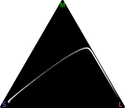

---
title: Color
...

Color is more complicated than you think it is, and much of that complication will matter in computer graphics.

# Physics

Each photon has a wavelength and energy, which are inversely proportional. For most graphics purposes, it is sufficient to know that high energy = low wavelength. Visible light has wavelengths between 380nm and 750nm

Most sources of light include photons of many different wavelengths. The main exceptions are lasers, LEDs, and some types of florescence.

# Biology

Your eye has four^[A small percentage of females have five: rods and four types of cones. I am unaware of any study showing these women have learned to distinguish the extra colors those extra cones theoretically allow them to perceive.] types of light receptors: rods and three types of cones. All four operate on the same general principle:

- When a photon hits the receptor, it has some chance of signalling the brain that it saw light.
- That chance is dependant on the wavelength of the light, with a roughly bell-shaped probability curve.
- After signaling, the receptor needs a short reset time before it can signal again.
- Light intensity is percieved based on frequency of signalling.

The rods react to most visible spectrum wavelenghts and have high proability of signaling; in any well-lit scenario they are more-or-less all continuously signalling; only in very dim-light situations do they provide useful visual information to the brain.

| Energy | Wavelength | Color | Peak | Approximate Range |
|:------:|:----------:|:-----:|:----:|:-----:|
| High (H) | Short (S) | Blue | 445nm | 400–520nm |
| Medium (M) | Medium (M) | Green | 535nm | 420–640nm |
| Low (L) | Long (L) | Red | 575nm | 450–680nm |

 for image provenance](https://upload.wikimedia.org/wikipedia/commons/1/1e/Cones_SMJ2_E.svg)

Because of the overlap of cone sensitivity regions, there is no wavelength or combination of wavelengths of light that will cause the medium-sensitivity "green" cone to signal the brain without one of the other two cone types also signaling the brain.

You have many more red and green cones than blue cones, and the precise ratios vary by person and by region of the retina. This distribution effects only the resolution of perception in different colors, not the perceived color itself.

Pupils will dilate or contract to try to keep the number of photons entering the eye within optimal ranges: few enough photons that you can distinguish between light intensities, but enough photons that cones are providing frequent information to the brain. This means that absolute intensity of illumination is not a perfect predictor of perceived brightness of color: rather, brightness is perceived relative to the overall scene.

The optic center of the brain further removes perception of intensity and, to some degree, color. A region appears to be darker if surrounded by brighter things and brighter if surrounded by darker things. Similarly, after some time wearing rose-colored glasses the world stops looking rose-colored and starts to look normal again. Both of these phenomenon are cognitive, not physiological, but also both hard-wired into the brain.

# Modeling Perception

A straightforward way of modeling the perception of color is with three numbers: the signaling rate (in Hertz) of each of the three cone types. Perhaps for one region each red cone is signaling six times a second, each green cone once every four seconds, and each blue cone twice a second, for a cone response vector of (6, ¼, 2). This can be seen as the color data that travels along the optic nerve from retina to brain.

<figure>
<svg viewBox="0 15 200 220" style="max-width:30em; display:table; margin:auto; font-size:10px; font-family:Arial;">
<circle cx="40" cy="160" r="2"/>
<line x1="40" y1="160" x2="40" y2="40" stroke="black"/>
<path d="m 40,40 -2,0 2,-6 2,6 Z"/>
<text x="40" y="26" text-anchor="middle" fill="green">M</text>
<g transform="translate(40,160) rotate(80) translate(-40,-160)">
<line x1="40" x2="40" y1="160" y2="40" stroke="black"/>
<path d="m 40,40 -2,0 2,-6 2,6 Z"/>
</g>
<text x="170" y="138" text-anchor="start" fill="darkred">L</text>
<g transform="translate(40,160) rotate(130) translate(-40,-160)">
<line x1="40" x2="40" y1="160" y2="80" stroke="black"/>
<path d="m 40,80 -2,0 2,-6 2,6 Z"/>
</g>
<text x="108" y="222" text-anchor="start" fill="blue">S</text>
<text x="36" y="163" text-anchor="end">0 Hz</text>
<line x1="30" y1="60" x2="38" y2="60" stroke="black"/>
<text x="28" y="63" text-anchor="end">12 Hz</text>
<line x1="142" y1="145" x2="142" y2="153" stroke="black"/>
<text x="142" y="163" text-anchor="middle">12 Hz</text>
<line x1="86" y1="202" x2="86" y2="210" stroke="black"/>
<text x="86" y="220" text-anchor="middle">12 Hz</text>
</svg>
<figcaption>Three cone response rates.</figcaption>
</figure>

The cone response vector is not particularly useful representation for computer graphics; indeed, I've never seen it used in any code. One problem is its nonlinear scale: doubling the number of photons brings the Hz twice as close to their maximum value and that maximum, while *roughly* 12 Hz, varies by person and is a bit different each time each cone it signals. So we want to apply some kind of nonlinear rescaling of the axes to bring them into more perceptually-useful units.

<figure>
<svg viewBox="0 15 240 210" style="max-width:33em; display:table; margin:auto; font-size:10px; font-family:Arial;">
<circle cx="40" cy="160" r="2"/>
<line x1="40" y1="160" x2="40" y2="40" stroke="black"/>
<path d="m 40,40 -2,0 2,-6 2,6 Z"/>
<text x="40" y="26" text-anchor="middle" fill="green">M</text>
<g transform="translate(40,160) rotate(80) translate(-40,-160)">
<line x1="40" x2="40" y1="160" y2="40" stroke="black"/>
<path d="m 40,40 -2,0 2,-6 2,6 Z"/>
</g>
<text x="170" y="138" text-anchor="start" fill="darkred">L</text>
<g transform="translate(40,160) rotate(130) translate(-40,-160)">
<line x1="40" x2="40" y1="160" y2="80" stroke="black"/>
<path d="m 40,80 -2,0 2,-6 2,6 Z"/>
</g>
<text x="108" y="222" text-anchor="start" fill="blue">S</text>
<text x="36" y="163" text-anchor="end">0</text>
<line x1="30" y1="60" x2="38" y2="60" stroke="black"/>
<text x="28" y="63" text-anchor="end">1</text>
<line x1="142" y1="145" x2="142" y2="153" stroke="black"/>
<text x="142" y="163" text-anchor="middle">1</text>
<line x1="86" y1="202" x2="86" y2="210" stroke="black"/>
<text x="86" y="220" text-anchor="middle">1</text>
<g stroke-dasharray="2 2" fill="none" stroke="black">
<path d="m 40,60 102,-15 0,97 46,41 -102,15 0,-97 102,-15 0,97 M 40,60 l 46,41 M 40,60 m 102,-15 46,41"/>
</g>
</svg>
<figcaption>Volume of possible normalized cone response rates.</figcaption>
</figure>

However, a normalized volume is still not ideal because both the pupil and the optic center normalize overall brightness. Effectively that means we perceive *relative* response rates far more than we perceive *absolute* response rates. Conceptually, this projects a point in the volume onto a brightness-normalized plane, where (1, 1, 0) and (⅓, ⅓, 0) look like the same color (unless they are next to one another, in which case one looks darker than the other).

<figure>
<svg viewBox="0 15 240 210" style="max-width:33em; display:table; margin:auto; font-size:10px; font-family:Arial;">
<circle cx="40" cy="160" r="2"/>
<line x1="40" y1="160" x2="40" y2="40" stroke="black"/>
<path d="m 40,40 -2,0 2,-6 2,6 Z"/>
<text x="40" y="26" text-anchor="middle" fill="green">M</text>
<g transform="translate(40,160) rotate(80) translate(-40,-160)">
<line x1="40" x2="40" y1="160" y2="40" stroke="black"/>
<path d="m 40,40 -2,0 2,-6 2,6 Z"/>
</g>
<text x="170" y="138" text-anchor="start" fill="darkred">L</text>
<g transform="translate(40,160) rotate(130) translate(-40,-160)">
<line x1="40" x2="40" y1="160" y2="80" stroke="black"/>
<path d="m 40,80 -2,0 2,-6 2,6 Z"/>
</g>
<text x="108" y="222" text-anchor="start" fill="blue">S</text>
<text x="36" y="163" text-anchor="end">0</text>
<line x1="30" y1="60" x2="38" y2="60" stroke="black"/>
<text x="28" y="63" text-anchor="end">1</text>
<line x1="142" y1="145" x2="142" y2="153" stroke="black"/>
<text x="142" y="163" text-anchor="middle">1</text>
<line x1="86" y1="202" x2="86" y2="210" stroke="black"/>
<text x="86" y="220" text-anchor="middle">1</text>
<g stroke-dasharray="2 2" fill="none" stroke="black">
<path d="m 40,60 102,-15 0,97 46,41 -102,15 0,-97 102,-15 0,97 M 40,60 l 46,41 M 40,60 m 102,-15 46,41"/>
</g>
<path d="m 40,60 102,82 -56,56 z" fill="rgba(0,0,0,0.25)"/>
</svg>
<figcaption>Conceptual plane of color perception within normalized cone response volume.</figcaption>
</figure>

Conceptually, this gives us a triangle of possible colors,
to which relative brightness can be added as a third axis.
However, cone responsiveness overlaps so not all of this triangle of colors is achievable in practice.
Plotting single-wavelength light within this triangle shows a curved-boundary subregion; and at the extreme edges the cones are so dimly responsive that only very intense single-wavelength light courses can ever cause them to be perceived.

