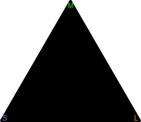
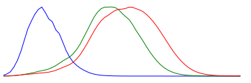

---
title: Color
...

# Cones: LMS

Light is delivered in photons, each of which has a wavelength. Visible light wavelengths are roughly from 380nm to 750nm.

Your eye has 4 types of color receptors:
rods, L-cones, M-cones, and S-cones.^[Some women also have a fourth type of cone, but I have not yet seen studies showing women who have learned to articulate the extra color perception this gives them.]
All four operate on the same principle:

- When a photon hits the receptor, it has some chance of signaling the brain that it saw light.
- That chance is dependent on the wavelength of the light, with a roughly bell-shaped probability curve.
- After signaling, the receptor needs a short reset time before it can signal again. This varies, but something under 0.1 seconds is a reasonable estimate.
- Light intensity is perceived based on frequency of signaling.

Rods react to most of the visible spectrum and react very easily, so except in very dim-light situations they effectively signal as soon as their reset time elapses, providing no useful information to the brain. They're important for night vision, but not for color.

The most direct way to model color perception would thus be as three durations: the average time between two firings of an L-cone, of an M-cone, and of an S-cone. Thus, we might say the cone response is (0.1s, 2.4s, 0.4s) to mean the L-cone is firing almost immediately after reset, the M-cone is almost idle, and the S-cone is somewhere in between.

Seconds are awkward in this context in part because they are unbounded, approaching infinity in complete darkness; and because the difference in light intensity needed to go from 0.11s to 0.10s is much much larger than the difference needed to go from 11s to 10s. But it's smooth and monotonic so three is some normalizing function that would convert these seconds into a some kind of nicely-behaved range where 0 means "never firing" and 1 means "firing as often as possible". We'll skip the math and assume we have access to that normalized cone signaling numbers.

# Cone chromaticity

Normalized cone signaling would form a cube, from (0,0,0) to (1,1,1).
But we don't perceive a cube of color.
There are various ways that (0.1, 0.2, 0.3) can change into (0.2, 0.4, 0.6) with no change in the color of the object being observed, including pupil dilation, clouds moving away from the sun, etc. We can perceive this overall intensity of light or "luminosity", but we our brain filters out overall luminosity and perceives only relative luminance^[Several related terms are technically distinct but sometimes used interchangeably in computer graphics: **Luminosity** = Watts of photon radiation (either overall or in the visual range). **Luminance** = Luminosity per unit area. **Brightness** = perception of luminance, generally relative to it surroundings. **Lightness** = perception of "how light it is", a non-linear scale as the eye is better at distinguishing between darkish shades than light shades or very dark shades. **Value** = "distance from black"; if a white light and a red light have the same value, they are emitting equivalent numbers of long-wavelength photons, but the white light is also emitting short-wavelength photons and thus has higher luminosity.] of adjacent colors. So a better model of color is as 2D color vector $(l,m,s)$ where $l+m+s = 1$, coupled with a separate luminance level in the form of a scalar being multiplied by the whole vector.

Ignoring the luminance component for the time being, our color space is now a triangle:

<figure>
<svg xmlns="http://www.w3.org/2000/svg" version="1.1" viewBox="-2 -2 204 177.20508075688772" style="max-width:24em">
<path d="M 200,173.20508075688772 100,0 0,173.20508075688772 Z" stroke-width="4" stroke="black" stroke-linejoin="round" fill="black"/>
<text x="195" y="173.20508075688772" fill="#ff8080" text-anchor="middle" font-family="arial" font-size="10px">L</text>
<text x="100" y="10" fill="#00ff00" text-anchor="middle" font-family="arial" font-size="10px">M</text>
<text x="5" y="173.20508075688772" fill="#8080ff" text-anchor="middle" font-family="arial" font-size="10px">S</text>
</svg>
<figcaption>Cone-based color triangle.</figcaption>
</figure>

# Achieving chromaticities with light: RGB

In order for us to display the color represented by some point in this triangle, we have to find a combination of light of various wavelengths that triggers that ratio of response in the three cone types. The first step toward that goal is to find where each individual wavelength falls in this triangle.
Fortunately, others have done this work for us and published the results;
using the table from Stockman et al (1993)^[Andrew Stockman, Donald MacLeod, Nancy Johnson (1993) "Spectral sensitivity of the human cones." *Journal of the Optical Society of America A*, 10(12) pp. 2491--2521] we get

{style="max-width:24em"}

By combining multiple wavelengths we can get any point inside that curve. Points outside the curve represent cone responses that cannot be triggered by any combination of light.^[Presumably pharmaceuticals or surgery could cause the optic nerve to signal impossible ratios like $(L,M,S)=(0,1,0)$. While I am unaware of studies that have attempted that, I postulate that the result would be painful rather than interesting, similar to the experience of other abnormal sensations like having your pupils artificially dialed so all cones are firing very quickly or the pins-and-needles feeling of having some pressure neurons firing at maximum levels while adjacent ones are not firing at all.]
In other words, only a subset of theoretical cone responses actually represent colors. 

It is worth noting that not every eye is the same. The exact ratios of pigments inside the cones vary by individual, meaning the exact same wavelengths of light might cause a response of (0.1, 0.4, 0.5) in one individual and (0.1, 0.45, 0.45) in another. The variations are typically fairly small, and when larger are called "color blindness" (a term that also refers to more extreme variations such as having only two types of working cones).

So, we want to make a display that can show a lot of colors. But creating arbitrary sets of wavelengths is quite expensive, so we want to pick just a few wavelengths that we can combine to make most colors. Because the curve is roughly triangular, picking three is a common choice. But getting a *single* wavelength is much harder than a narrow band of wavelengths and some wavelengths the eye hardly perceives at all so it would take too much energy to use them effectively in a display.

{style="max-width:24em"}

As a result, early color displays played with several different colors of light, but by 1993 had mostly settled on ITU-R Recommendation 709 which used colors made of several wavelengths, which can be plotted on our cone triangle as follows.

![Rec.709 color triangle and relative eye responsiveness to various pure wavelengths. The triangle shows all colors (luminance aside) that are representable  three dots are the Red, Green, and Blue primary color used by most RGB displays (as of 2021). The triangle does not extend to the L corner because it requires a lot of energy to get those wavelengths bright because none of the cones are very responsive there. It does not touch the curve anywhere because single-wavelength light sources are challenging to manufacture.](color-curve.svg){style="max-width:24em"}

You'll notice that there is space in the above image that is inside the visible-color curve but outside the colored-in triangle. Those colors exist in the real world, but cannot be replicated on this screen. Later ITU-R recommendations (Rec.2020 published in 2012 and Rec.2100 published in 2016) suggest single-wavelength lights to get a larger region, but while that makes the triangle bigger it still leaves out some colors. Most of the monitors I checked in 2021 still used Rec.709 colors instead, which is why I rendered the Rec.709 triangle above.

Note that some colors can be represented on a monitor but are not shown in the diagram because they differ from the diagrams colors only in luminance.
For example, yellow, is a higher-luminance version of the point halfway between the green and red corners
and forest green is a lower-luminance version of a point near the green corner of the triangle.

# Non-linear storage: Gamma

Let's review where we stand:

- The eye has three color receptors, L, M, and S (named after the long, medium, and short-wavelength light they perceive).
- Because their sensitivities overlap, some combinations of LMS response are impossible in the visual world. The achievable subregion is curved.
- Because the curve is roughly triangular, mixing three light colors (called primary colors) can give a pretty good approximation of the visible light spectrum. More primary colors would do a better job, but is generally not seen to be worth the cost.
- We call the three primaries "Red", "Green", and "Blue" as by themselves they (roughly) correspond to colors with those names.

We've almost reached how color is actually stored in a computer; the missing component is "gamma".

Let's assume we have two colors that differ only in luminance.
The formal term for this is having the same "chromaticity".
They eye roughly distinguishes the two by the relative luminance,
so 1.0 and 0.9 are seen as much more similar than are 0.2 and 0.1.
The formal term for this relative perception is "lightness".

Given that we want to store a grid of millions of colors for every picture we store, we want the storage to be small, so we have an incentive to represent colors on a logarithmic scale instead of a linear scale to handle this relative comparison.
But a pure logarithmic scale is not ideal, both because the eye is not great at distinguishing very dark colors
and because most people look at screens in a lit environment where that background light influences.

In exploring efficient ways of encoding lightness, early efforts stumbled on a simple-to-implement-in-analog-electronics system known as "gamma", from the generic equation $r = s^{\gamma}$ where $s$ is the stored lightness and $r$ is the real luminosity. A gamma of $\gamma = 2.2$ was found to be a good value, and many CRT displays were manufactured that applied that equation automatically in their circuitry. Some also featured an adjustable gamma nob so that, but moving physical wire coils and so on, the $\gamma$ in $r = s^{\gamma}$ could be adjusted.

As digital display technologies became prevalent and a simple formula was no longer needed, the name gamma stuck, as did most of the implementation. However, because the eye is not good at very dim colors people found that a raw gamma scale resulting in 3--5% of all color signals being perceived as indistinguishably "black". So modern "gamma correction" is generally a piecewise equation, linear for dim colors and polynomial for brighter colors. The most common version is the sRGB gamma function^[These formulae are given in the standard document IEC 61966-2-1, but are not quite inverses of one another because $0.0405/12.92 \ne 0.0031308$. I do not know why this discrepancy exists.]:

$$L_{\text{display}} = \begin{cases}
L_{\text{storage}}/12.92 &\text{if }L_{\text{storage}} \le 0.04045 \\
\displaystyle \left(\frac{L_{\text{storage}}+0.055}{1.055}\right)^{2.4} &\text{if }L_{\text{storage}} > 0.04045
\end{cases}$$
$$L_{\text{storage}} = \begin{cases}
12.92 L_{\text{display}} &\text{if }L_{\text{display}} \le 0.0031308 \\
1.055{L_{\text{display}}}^{1/2.4}-0.055 &\text{if }L_{\text{display}} > 0.0031308
\end{cases}$$

# Bytes

While higher-range images are starting to gain popularity, most displays and image formats use 8 bits each for Red, Green, and Blue.
Web standards have popularized representing the result as thre hexadecimal bytes, RGB, each written with two hex digits in a row with a hashtag in front, like `#e3b021` for this color: . Unless otherwise noted, it is safe to assume these are in the sRGB color space and stored post-gamma-correction, which means that most monitors can display them as-is but that arithmetic on the colors requires conversion to linear display intensities before it is accurate.

Systems interested in optimal compression of information, ranging from the earliest color television broadcast signals to the most recent compression/decompression algorithms (also know as "codecs"), have observed that they eye perceived chromaticity at a lower resolution than it perceived luminance. They thus decompose color using a different set of axes than RGB, where one of the axes is some form of brightness, lightness, luminance, or luminosity, in part so they can transmit more bits of luminance than they do of chromaticity.

[HSL](https://en.wikipedia.org/wiki/HSL_and_HSV) dates back to 1938 and was designed for color television, and thus the first separate-lightness model to be implemented in hardware. In it, <b>H</b>ue is an angle around the color wheel and <b>S</b>aturation is intensity of color (i.e., non-gray-ness).

HSL has an angular coordinate (H) which makes it awkward for use in digital computation.
As digital replaced analog in displays, [YCbCr](https://en.wikipedia.org/wiki/YCbCr) became more popular than HSL.
In YCbCr, Y represented luminance (or Y' represents luma, a gamma-corrected version of luminance; both YCbCr and Y'CbCr are used),
Cb is how much of that luminosity comes from blue
and Cr is how much of that luminosity comes from red.
Along with a few variants like YUV and YcCbcCrc that replace Cb and Cr with similar numbers computed in slightly different ways, YCbCr is the dominant way color is stored for lossy compression of digital media, including JPEG, H264, HEVC, VP9, and so on.

By design, all HSL and YCbCr colors are representable using RGB lights.
Sometimes it is desirable to use a model that allows representing *all* chromaticities, not just those a computer can display.
[CIE 1931](https://en.wikipedia.org/wiki/CIE_1931_color_space) and [CIELUV](https://en.wikipedia.org/wiki/CIELUV) were designed by international standards bodies and both roughly approximate a warped version of the LMS triangle discussed earlier so that the curve comes close to filling a square and is stretched to make distance in the warped space roughly approximate human perceived difference of colors.
While not designed for digital display, both of CIE models (and several related variants) are commonly used to describe calibrations of display components and the interrelationship of different color models and different kinds of displays.

# Why print is more complicated

The above discussion applies to light-emitting displays: laptops, desktops, phones, etc. Print media has additional constraints.

The basic function of colored ink is to absorb some wavelengths and not others. Cyan ink, for example, absorbs most wavelengths that we'd see as being orange or red. Picking the best inks is tricky: if they absorb to many wavelengths then they overlap and some bright colors become unpresentable; if they absorb too few then some wavelengths cannot be absorbed and some dark colors become unpresentable.

The most common compromise is to have a CMYK printer: <b>C</b>yan, <b>M</b>agenta, and <b>Y</b>ellow ink that each remove a bit shy of a third of the visible spectrum and blac<b>K</b> ink that absorbs the entire visible spectrum and can help approximate those darker colors that the gaps between the CMY absorptions make hard by themselves. Common CMYK inks together cover a smaller and somewhat different region of possible colors than RGB.

Higher-end printing systems use many more inks covering many narrow bands of photons to give a higher degree of color fidelity; The [Pantone system](https://en.wikipedia.org/wiki/Pantone#Pantone_Color_Matching_System) is probably the best known with 14 base pigments instead of CMYK's 4.

Even with many pigments, print and light colors have different coverage than one another. In an RGB display, white is (1,1,1) meaning that roughly ⅓ of light energy is coming from wavelengths that look purely red. But on paper, white is a mix of all the visible spectrum, and to filter out all but the red light will result in a darker red (relative to white) than would result if we turned off the G and B components of an RGB display. With enough pigments the chromaticities could be made to match, but not the luminances.
