---
title: 'HW1: 2D Rasterizer'
...

# Overview

In this assignment you'll draw 2D shapes by filling in individual pixels.

## Logistics

You need to write every method you submit yourself.
You cannot use other people's code or find the method in an existing library.
For example, you should not use Java's `Graphics` class,
PIL's `ImageDraw` module,
the CImg `draw_`* methods,
the Bitmap `Draw`* methods,
etc.

You are welcome to seek conceptual help from any source,
but cite it in a comment if you get it from something other than a TA, the instructor, or class-assigned readings.
You may only get coding help from the instructor or TAs.

Half of the points are for completing the required portions.
You may add as many points as you wish on optional portions.
Points in excess of 100% will carry over to other homework assignments.

## Example files

All the example images in this writeup are hyperlinks to the input file that generated them.
On some older browsers these hyperlinks might interact poorly with the mathematical formula rendering;
if you have trouble accessing the files, please let the instructor know.

## Structure and File Format

The same as [HW0](hw0.html): your program will read a file from the command line and create a PNG file.
The basic structure of the input file (lines with keywords and arguments, skipping unknown keywords, etc) remain unchanged.

# Required 

The required part is worth 50%

png
:   same as HW0

xyc, xyrgb
:   For this homework, when you see a vertex description line (`xyc`, `xyrgb`, or the optional `xyrgba`)
    you don't draw it; you store it in an ordered list.
    Most other commands will refer to earlier vertices in a one-indexed way: 1 is the first vertex listed, −1 the most recent one listed. So, for example, in the following input file

    

        png 20 30 hw1demo.png
        xyc    2  3   #ff0000
        xyrgb 10 29   0 127 0
        xyrgb 19  9   0 0 255
        trig 1 -1 2
        xyc    0 29   #770099
        trig 1 -2 -1

    the first `trig` has vertices (in order) of (2, 3), (19, 9), and (10, 29);
    the second `trig` has (2, 3), (19, 9), and (0, 29).

    Vertex indices will always refer to vertices earlier in the file.
    Vertex coordinates ($x$ and $y$) may be decimal numbers. Colors will still be integers.
    You no longer need to support `xy`; all coordinates will have colors specified in this assignment.

linec $i_1$ $i_2$ *hexcolorcode*
:   <a href="files/hw1linec.txt">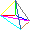</a>

    Draw an 8-connected line of the given color using the DDA algorithm between the two vertices given.
    Ignore the colors of the vertices.

    If the line extends farther in $x$ than in $y$, DDA steps in $x$.
    At any given integer $x$, the line itself may have a non-integer $y$, but pixels have integer coordinates.
    Draw the pixel at the integer $y$ of $⌊y + 0.5⌋$.
    
    The same logic applies to lines that extend farther in $y$ than in $x$ and their pixel's $x$ coordinates.
    
    In the case where you start or end with an integer endpoint, include the smaller value but not the larger.^[The smaller-but-not-larger rule is the correct rule for triangles, but not always sufficient for lines. However, the correct rule for lines depends on what other lines you want to connect it to, which our input format does not provide, so we'll use the smaller-but-not-larger rule for lines as well as triangles in this assignment]
    For example, if stepping between 20 and 10, include 10 but not 20.
    This rule prevents adjacent lines with a shared endpoint from both drawing that endpoint;
    for example, if one line goes from 5 to 10 and another from 10 to 15, only the second will draw pixel 10.

trig $i_1$ $i_2$ $i_3$
:   
    
    Fill a triangle between the given vertices, linearly interpolating the vertex colors as you go.
    Use a DDA-based scanline algorithm: DDA step in $y$ along the edges, then DDA step in $x$ between these points.^[If done properly, the $(x,y)$ along the edges will have integer $y$ but non-integer $x$; the $(x,y)$ of each pixel will both be integers; and you won't round any $x$ or $y$ coordinates.]

    Fill a vertex if its coordinates are inside the triangle, (e.g., pixel $(3, 4)$ is inside $(2.9, 4)$, $(3.1, 4.1)$, $(3.1, 3.9)$) on the left (small $x$) edge of the triangle, or on a perfectly horizontal top (small $y$) edge. Do not fill it otherwise.
    
    This coloring style is called Gouraud shading, hence the `g` in the keyword.

# Optional

## Colors

lineg $i_1$ $i_2$ (5%) <a href="files/hw1lineg.txt">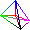</a>
:   Linearly interpolates colors on lines

tric $i_1$ $i_2$ $i_3$ *hexcolorcode* (5%) 
:   Fills a triangle as `trig` but uses the specified flat color, not linearly-iterpolated color

xyrgba *or* lineca/trica (10%) <a href="files/hw1rgba.txt">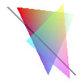</a> <a href="files/hw1trica.txt">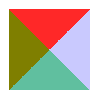</a>
:   Accept points `xycrgba` with a 4th color being an alpha (opacity) channel,
    and use that alpha in Gouraud shading (lineg and trig).

    And/or, add `lineca` and `trica` that act like `linec` and `tric` but take an extra 2 hex digits in the color code,
    which are alpha (opacity). So `#ff0000ff` is opaque red, `#0000ff07` is mostly transparent blue, etc.

    Use the over operator discussed [on Wikipedia](https://en.wikipedia.org/wiki/Alpha_compositing):
    $C_{o}={\frac {\alpha_{a}}{\alpha_{o}}}C_{a}+\left(1-{\frac {\alpha _{a}}{\alpha _{o}}}\right)C_{b}$.

## Shapes

polyec $n$ $i_1$ $i_2$ … $i_n$ *hexcolorcode* (10%) 
:    Fill the given n-vertex polygon using the "even-odd rule", as described in [the SVG Spec](http://www.w3.org/TR/SVG/painting.html#FillProperties).

    Usually this is best done by going one scanline at a time, finding all of the edges that cross it, and then filling between pairs.
    Don't forget to count vertexes that fall exactly on a scanline appropriately. 

polynz $n$ $i_1$ $i_2$ … $i_n$ *hexcolorcode* (10%) 
:    Fill the given n-vertex polygon using the "non-zero rule", as described in [the SVG Spec](http://www.w3.org/TR/SVG/painting.html#FillProperties).

    Usually this is best done by going one scanline at a time, finding all of the edges that cross it, and then filling between pairs.
    Don't forget to count vertexes that fall exactly on a scanline appropriately. 

fann $n$ $i_1$ $i_2$ … $i_n$ (10%) <a href="files/hw1fann.txt">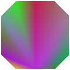</a>
:   Goaraud fill a polygon between $i_1$ and each adjacent pair of subsequent vertices
    (e.g., $i_1$ $i_2$ $i_3$ and $i_1$ $i_3$ $i_4$ and …). 

stripn $n$ $i_1$ $i_2$ … $i_n$ (10%) 
:   Goaraud fill a polygon between each three consecutive indices
    (e.g., $i_1$ $i_2$ $i_3$ and $i_2$ $i_3$ $i_4$ and …).

linewc $i_1$ $i_2$ $w$ *hexcolorcode* (10%) <a href="files/hw1linewc.txt">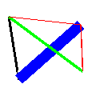</a>
:   Draw a line as a rectangle with width $w$ touching the two endpoints (line "butt" mode in [the SVG spec](http://www.w3.org/TR/SVG/painting.html#StrokeProperties)).

## Curves

cubicc $i_1$ $i_2$ $i_3$ $i_4$ *hexcolorcode* (15%) 
:   Draw a cubic bezier curve using the four control points given.
    I suggest using [De Casteljau's algorithm](http://www.cs.mtu.edu/~shene/COURSES/cs3621/NOTES/spline/Bezier/de-casteljau.html)
    (or [here](http://www.cubic.org/docs/bezier.htm))
    to break the curve into small lines. 

beznc $n$ $i_1$ $i_2$ … $i_n$ *hexcolorcode* (10%) <a href="files/hw1beznc.txt">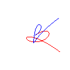</a>
:   Draw a bezier curve using the $n$ control points given.
    I suggest using [De Casteljau's algorithm](http://www.cs.mtu.edu/~shene/COURSES/cs3621/NOTES/spline/Bezier/de-casteljau.html)
    (or [here](http://www.cubic.org/docs/bezier.htm))
    to break the curve into small lines. 

cubicwc $i_1$ $i_2$ $i_3$ $i_4$ $w$ *hexcolorcode* (5%) 
:   Draw a cubic bezier curve of the given width.
    Usually this is done by turning the boundary of the curve into a polygon with a lot of vertices,
    adding two of the vertices at every step of De Caustlejau's algorithm.

cubicg $i_1$ $i_2$ $i_3$ $i_4$ (10%) <a href="files/hw1cubicg.txt">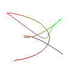</a>
:   Draw a cubic bezier curve interpolating the vertex colors as you go. 

cubicvwc $i_1$ $i_2$ $i_3$ $i_4$ $w_1$ $w_2$ $w_3$ $w_4$ *hexcolorcode* (10%) 
:   Draw a cubic bezier curve where the width is interpolated along the curve.
    Usually this is done by turning the boundary of the curve into a polygon with a lot of vertices, 
    adding two of the vertices at every step of De Caustlejau's algorithm.

ucbnc $n$ $i_1$ $i_2$ … $i_n$ *hexcolorcode* (10%) 
:   Draw a uniform cubic B-spline with the given control points.
    
    A B-spline is just a tool for defining Bezier curves.
    The B-Spline control points $p_1$, $p_2$, $p_3$, $p_4$ define the cubic Bezier control points 
    $(p_1 + 4p_2 + p_3)\over 6$, $(2p_2 + p_3) \over 3$, $(p_2+2p_3) \over 3$, $(p_2 + 4p_3 + p_4) \over 6$.

circle $i_1$ *radius* (15%) <a href="files/hw1circle.txt">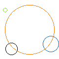</a>
:   Draw the outline of a circle centered at the given vertex with the given radius.
    Use the color of the vertex.
    You may assume the center vertex has integer coordinates and the radius is an integer.

## Antialiasing

aalinec $i_1$ $i_2$ *hexcolorcode* (10%) <a href="files/hw1aalinec.txt">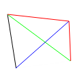</a>
:   Draw an anti-aliased line using the Wu algorithm.
    Use the over operator to compose transparent pixels.

aacircle $i_1$ *radius* (10%) <a href="files/hw1aacircle.txt">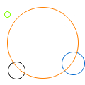</a>
:   Draw an anti-aliased circle using the Wu algorithm.
    Use the over operator to compose transparent pixels.

## Other

Feel free to add your own elements to the input set.
Submit an input file named `additional_.txt` where `_` is replaced by some number for each additional element you add.
The input file should include a line beginning `description` that describes the new element.
Points will be added at instructor discretion. 
