---
title: 'HW2: 3D Rasterizer'
new-2021:
	- made loadp required
notes:
    - consider making efficient screen clipping required
...

# Assignment Metadata

You need to write every method you submit yourself.
You cannot use other people's code or find the method in an existing library.
For example, you should not use Java's `Graphics` class,
PIL's `ImageDraw` module,
the CImg `draw_`* methods,
the Bitmap `Draw`* methods,
etc.

You may use external vector product and and matrix multiplication code if you wish.
However, the learning these libraries often requires as much time
as it would take to write them yourself.

	mult4by4(a, b):
		matrix answer = 4 by 4 matrix
		for(outrow from 1 to 4):
			for(outcol from 1 to 4):
				answer[outrow,outcol] = 0
				for(i from 1 to 4):
					answer[outrow,outcol] += a[outrow, i] * b[i, outcol]
		return answer

	multMbyV(mat, vec):
		vector answer = copy of vec
		for(outrow from 1 to 4):
			answer[outrow] = 0
			for(i from 1 to 4):
				answer[outrow] += mat[outrow, i] * vec[i]
		return answer

You are welcome to seek conceptual help from any source,
but cite it if you get it from something other than a TA, the instructor, or class-assigned readings.
You may only get coding help from the instructor or TAs.

# Overview

You'll need to keep track of the current set of transformations.
Model/View transformations are applied first, in reverse order; 
then perspective is applied. 
Thus, in the file snippet

	rotate 90   1 0 0
	frustum -1 1   -1 1   1 10
	translate -3 2 1
	trif 1 2 3

the triangle's points are first translated, then rotated, then the frustum is applied.

Note, however, that order of operations can be seen in two ways.
Rotating the camera 45° clockwise and then moving it 2 units to the right is the same operation as moving the world 2 units to the left and then rotating it 45° counterclockwise.
Depending on how you think of the transformations, they can appear to be happening first-to-last or last-to-first.

Some Model/View commands replace the current Model/View; this means later drawing commands ignore any Model/View commands that came before the replacing command.

The entire flow looks like this (required parts are in bold):

1. **When a color**, normal, or texture coordinate is specified, **remember it as the "current" value of that type**.
1. **When a point is specified, store it in a list as with HW1.  We'll index that list in the say way we did for that HW.**
	1. for the required part, just **store the $(x, y, z, w)$**
	1. some elective parts will also require storing the current normal, color, and/or texture coordinate with the point
2. When a drawing command is specified,
	1. It it involves creating several triangles, do that and send the triangles through the next steps
	2. **Apply Model/View transformations (rotations, scaling, translations, matrices, etc), if any, to each vertex.**
	3. Clip planes happen here.
	4. **Apply the current projection matrix, if any, to each vertex.**
	5. Frustum clipping happens here in OpenGl, but we won't add it.
	6. **Divide each $x$, $y$, and $z$ by $w$.**
	7. **Apply a viewport transformation so that $(-1, -1)$ is placed in the top left corner and $(1, 1)$ in the bottom right corner of the image.**
	8. **Rasterize the triangle into fragments, interpolating a $z$ value** (and other values as extras require) **for each pixel.
		Only continue with those pixels that are on the screen (i.e., $0 ≤ x < w$ and $0 ≤ y < h$) and have $z$ between 0 and 1.**
	9. **Check each pixel's $z$ against a depth buffer. Keep only those less than the buffer's current value.**
	10. Texture and lighting happens here to find colors for each fragment.  It can also happen before the depth buffer check if you prefer.
	11. **Set the pixel and depth buffer values**

# Assistance, Citation, and Cheating

Code for most of these algorithms is all over the Internet
and you probably have half a dozen version already on your machine.
This makes matters of plagarism, etc, a bit tricky.

| Action | Response |
|--------|----------|
| Using code from readings or lecture | OK |
| Using code from TA or instructor | OK, but cite |
| Using ideas from student, tutor, or website | OK, but cite |
| Using code from student, tutor, website, or program | Cheating |
| Using a drawing library instead of setting pixels manually | Cheating |

# Required Features

The required part is worth 50%

png *width* *height* *filename*
:	same syntax and semantics as HW0 and HW1.
	This also specifies the viewport transformation, as used in step 3.7. of the above outline.
	In the viewport step you will need to do something like `x += 1; x *= width/2;` and likewise for `y`; `z` and `w` are not changed.
	
</dd>

xyz $x$ $y$ $z$
:	Add the point ($x$, $y$, $z$, 1) to the vertex list.

trif $i_1$ $i_2$ $i_3$
:	
	Draw the given triangle, filled in <q>flat</q> in the current color 
	(as given by the last <code>color</code> command, or white if none were given).
	Apply any transformations and perspective that might exist as outlined in the overview.

color $r$ $g$ $b$
:	<a href="files/hw2color.txt">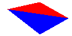</a>
	Defines the current color to be $r$ $g$ $b$, specified as floating-point values;
	$(0, 0, 0)$ is black, $(1, 1, 1)$ is white, $(1, 0.5, 0)$ is orange, etc.
	You only need to track one color at a time.

	You'll probably need to map colors to bytes to set the image.
	All colors &le; 0.0 should map to 0, all colors &ge; 1 should map to 255;
	map other numbers linearly (the exact rounding used is not important).

	If you do lighting, you'll need to store light values &gt; 1 and not clamp to 1 until after lighting.
	If you do not do lighting, you can clamp colors when you read them.

loadmv $a_{1,1}$ $a_{1,2}$ $a_{1,3}$ $a_{1,4}$ $a_{2,1}$ $a_{2,2}$ ... $a_{4,4}$
:	<a href="files/hw2loadmv.txt">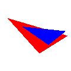</a>
	Load the given model/view matrix (specified in row-major order).
	This replaces any existing model/view matrix.

loadp $a_{1,1}$ $a_{1,2}$ $a_{1,3}$ $a_{1,4}$ $a_{2,1}$ $a_{2,2}$ ... $a_{4,4}$
:	<a href="files/hw2loadp.txt">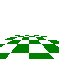</a>
	Load the given projection matrix (specified in row-major order).
	This replaces any existing projection matrix.

Per-pixel clipping
:	
	Only draw pixels that lie on the screen with a <var>z</var> between 0 and 1.

Depth buffer
:	<a href="files/hw2depth.txt">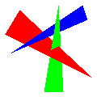</a>
	Keep a depth value for each pixel, initially 1 for all pixels.
	Only draw a pixel if its $z$ is less than or equal to the $z$ in the depth buffer.
	If you draw a pixel, update the depth buffer with it's $z$.

# Optional Features

## Perspective (0&ndash;25)

If (and only if) you implement the core perspective features
you may earn additional points as follows

xyzw $x$ $y$ $z$ $w$ (5 points)
:	
	Add the point ($x$, $y$, $z$, $w$) to the vertex list.
	Divide by $w$ after multiplying by all matrices but before scan converting.

frustum *l* *r* *b* *t* *n* *f* (5 points)
:	<a href="files/hw2frustum.txt">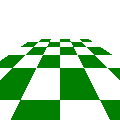</a>
	Set the projection to be a perspective projection.
	The near rectangle of the frustum 
	is $(l, b, -n)$ $(l, t, -n)$, $(r, b, -n)$, $(r, t, -n)$;
	the point of the pyramid the frustum is made of is at $(0, 0, 0)$;
	the far plane is at $z = -f$.
	This parallels the glFrustum command and the matrix documented by OpenGL should work.
	This *replaces* the existing projection transformation.

ortho *l* *r* *b* *t* *n* *f* (5 points)
:	<a href="files/hw2ortho.txt">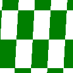</a>
	Set the projection to be an orthogonal projection. The box that can be seen is 
	$[l, r]$ in x; 
	$[b, t]$ in y; and
	$[-f, -n]$ in z. 
	This is similar to the glOrtho command; however, that command sets the near z to −1, not 0.
	If you use $nearVal = 2n - f$ then the matrix documented by OpenGL should work.
	This *replaces* the existing projection transformation.

perspective-correct interpolation (0&ndash;10 points)
:	<a href="files/hw2persp.txt">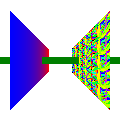</a>
	Linear interpolation isn't quite right for non-coordinate values.
	When interpolating some value $Q$ while making pixels,
	instead interpolate ${Q \over w}$;
	also interpolate ${1 \over w}$
	and use ${Q \over w} \div {1 \over w}$ as the $Q$ value for each fragment.
	
	You get 10 points for perspective-correct interpolation
	only if you also do either `trig` or `texture`.
	It applies to normals and lighting too,
	but is generally less obvious in its results.

## Matrix Manipulation (0&ndash;50)

translate $d_x$ $d_y$ $d_z$ (5 points)
:	
	Add a translation to the Model/View transformations.

rotatex *degrees*, rotatey *degrees*, and rotatez *degrees*  (5 points)
:	<a href="files/hw2rotatex.txt">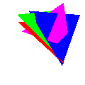</a>
	Add a counter-clockwise rotation around the given axis to the Model/View transformations.

rotate *degrees* *axisx* *axisy* *axisz* (10 points)
:	<a href="files/hw2rotate.txt">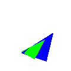</a>
	Add a counter-clockwise rotation of the given number of degrees around the given axis.
	This is what glRotate does, and documentation of that function might help.

scale $s_x$ $s_y$ $s_z$ (5 points)
:	
	Add a scale to the Model/View transformations.

lookat *eye* *center* $up_x$ $up_y$ $up_z$ (10 points)
:	
	Replace the Model/View with a look-at transformation.
	Look from the vertex given by index *eye* toward the vertex given by index *center*
	such that the up orientation is as similar to ($up_x$, $up_y$, $up_z$) as the *eye* and *center* allow.
	This parallels the gluLookAt command and the matrix documented by OpenGL should work.

multmv $a_{1,1}$ $a_{1,2}$ $a_{1,3}$ $a_{1,4}$ $a_{2,1}$ $a_{2,2}$ ... $a_{4,4}$ (5 points)
:	
	Add the given model/view matrix (specified in row-major order) to the existing model/view transformation.
	Unlike `loadmv`, this does not replace what was already there.

Normal Transformation (0&ndash;10 points; requires lighting and transformation matrices)
:	<a href="files/hw2ball.txt">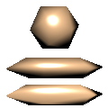</a>
	Vectors (sunlight, normal, clipplane) ought to be multiplied by a variant of the model/view matrix.
	If point p is modified by multiplication $M \vec{p}$ then vector $\vec{v}$ is modified by multiplication $\vec{v} M${-1}$.
	However, you do not need to compute the inverse:
	this is the same as saying that 
	
	1. rotations (including `lookat`) apply normally; 
	2. translations are ignored; and 
	3. scaling is applied in inverse (i.e., $({1 \over sx}, {1 \over sy}, {1 \over sz})$. 
	
	You do not need to handle `loadmv` or `multmv`.

	Sunlights should be modified when specified.
	Normals should be modified during the `trig`, `trif`, etc, command.
	Be sure to re-normalize the normals after transformation.
	

## Scan Converting (0&ndash;20)

trig $i_1$ $i_2$ $i_3$  (10 points)
:	
	Change `xyz` to store the current color
	(as defined by the most recent `color` command, or white if there was no such command)
	with each vertex it defines.
	Draw a gouraud-shaded triangle using those vertex colors.

Efficient screen clipping  (10 points)
:	
	When scan-converting triangles, have the first step on both edges and scanlines move not just to an integer, but to an integer inside the bounds of the screen; and stop when you leave the bounds of the screen.

	This should allow you to fill gargantuan triangles quickly.

Interplating more values
:	Some of the vertex shader methods will require you to interpolate additional values during scan converting,
	such as texture coordinates or surface normals.  There are not separate points for this, but it is worth designing your scan converting to allow this.

## Geometry modification (0&ndash;60)

clipplane $p_1$ $p_2$ $p_3$ $p_4$ (15 points)
:	
	Clip triangles before drawing them.
	Clipping a triangle along one plane might turn it into two triangles (by clipping off a corner).

	Points that satisfy $(p_1, p_2, p_3, p_4) \cdot (x, y, z, w) >= 0$ should be kept.
	Apply this to the vertices of a triangle after the Model/View transformations and before the Projection transformations.

cull (5 points)
:	<a href="files/hw2cull.txt">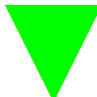</a>
	If you have seen a `cull` command,
	only draw triangles if their vertices would appear in counter-clockwise order on the screen.
	Otherwise simply ignore them.

rectbezf *subd* $i_{1}$ $i_{2}$ $i_{3}$ ... $i_{16}$ (10 points)
:	
	Subdivide the given cubic Bezier patch into $2^{subd}$ by $2^{subd}$ quads and then draw each quad as two triangles as if using `trif`.
	*subd* will always be an integer greater than zero.
	
	<svg xmlns="http://www.w3.org/2000/svg" version="1.1" viewBox="0 -2 164 156" style="width:12em; float:left;">
	<g transform="translate(8.677702,-199.06137)">
	<path stroke-linejoin="round" style="color:#000000;" d="m142,306-20-20,0-40-20-20m0,60-20-20,0-40-20-20m0,100-20-20,0-40-20-20m20,120-20-20,0-40-20-20m40,80,20-40,40-20,40,20m-120,20,20-40,40-20,40,20m-120-20,20-40,40-20,40,20m-80,60,20-40,40-20,40,20" stroke="#000" stroke-width="1" fill="none"/>
	<path stroke-linejoin="round" style="color:#000000;" d="m21,253,15.9,25.5,29.5-27.2-13.4-25.4z" stroke="#00F" stroke-width="1" fill="none"/>
	<path stroke-linejoin="round" style="color:#000000;" d="m31.6,318-4-36-16-24m86,18-4-36-16-24m-66,42,26-34,40-8m-50,66,26-34,40-8m-62,78,26-34,40-8m-60-52,16,24,4,36" stroke="#F00" stroke-width="1" fill="none"/>
	<path stroke-linejoin="round" style="color:#000000;" d="m32.6,251c0,0.418-0.339,0.758-0.758,0.758-0.418,0-0.758-0.339-0.758-0.758,0-0.418,0.339-0.758,0.758-0.758,0.418,0,0.758,0.339,0.758,0.758z" stroke="#0F0" stroke-width="1" fill="none"/>
	<path stroke-linejoin="round" style="color:#000000;" d="m27.6,274-20-20m-2,16,20-40" stroke="#000" stroke-width="0.5" fill="none"/>
	<path stroke-linejoin="round" style="color:#000000;" d="m66.1,246-16-24m-9.54,6.99,40-8" stroke="#000" stroke-width="0.5" fill="none"/>
	<path stroke-linejoin="round" style="color:#000000;" d="m73.6,300-20-20m-8,10,40-20" stroke="#000" stroke-width="0.5" fill="none"/>
	<text font-size="8px" y="351.36166" x="41.751324">1</text>
	<text font-size="8px" y="311.64749" x="61.910519">2</text>
	<text font-size="8px" y="292.70712" x="100.04377">3</text>
	<text font-size="8px" y="309.87973" x="141.96509">4</text>
	<text font-size="8px" y="329.0726" x="16.706186">5</text>
	<text font-size="8px" y="264.67538" x="75.042496">7</text>
	<text font-size="8px" y="285.38358" x="124.28741">8</text>
	<text font-size="8px" y="290.18179" x="14.938421">9</text>
	<text font-size="8px" y="245.98758" x="123.27728">12</text>
	<text font-size="8px" y="267.9584" x="-9.052702">13</text>
	<text font-size="8px" y="223.76419" x="11.150351">14</text>
	<text font-size="8px" y="202.80356" x="57.364834">15</text>
	<text font-size="8px" y="223.25919" x="100.54886">16</text>
	</g>
	</svg>
	
	Bezier patch subdivision is done much like curve subdivision:
	the point at $(s, t)$ is found by finding the $(s, t)$ point on each quad,
	using those points to make a lower-order bezier patch, and iterating down to just a single point.
	Thus, in the illustration the 16 input points define 9 quads (black); 
	The first interpolation defines 4 (red);
	then 1 (blue);
	and finally a single point on the surface (green).
	The normal at that point is the surface normal of the blue quad
	(i.e., the cross-product of the two diagonals of that quad),
	although the normal is not needed for flat shading.

rectbezg (5 points)
:	<a href="files/hw2rectbezg.txt">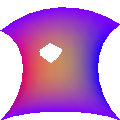</a>
	like `rectbezf` except uses color interpolation instead of flat color. 

tribezf *subd* $i_1$ $i_2$ $i_3$ ... $i_{10}$ (10 points)
:	
	Subdivide the given cubic Bezier patch to have $2^{subd}$ triangles on each side, then draw each quad as if using `trif`.
	*subd* will always be an integer greater than zero.
	
<svg xmlns="http://www.w3.org/2000/svg" version="1.1" viewBox="0 -5 139 118" style="width:12em; float:left;">
	<g transform="translate(0.95435238,-193.75351)">
	<text font-size="8px" y="266.7561" x="-1.3293524">1</text>
	<text font-size="8px" y="239.38474" x="39.658611">2</text>
	<text font-size="8px" y="259.16391" x="82.907982">3</text>
	<text font-size="8px" y="305.67599" x="101.68401">4</text>
	<text font-size="8px" y="218.29778" x="16.677635">5</text>
	<text font-size="8px" y="279.59158" x="124.17944">7</text>
	<text font-size="8px" y="199.39413" x="58.827747">8</text>
	<text font-size="8px" y="242.04948" x="123.76447">9</text>
	<text font-size="8px" y="219.10527" x="101.56762">10</text>
	<path stroke-linejoin="round" d="m10,62.3,40-20-20-20z" fill-opacity="0.25098039" transform="translate(-8.677702,199.06137)" stroke="#000" stroke-linecap="round" stroke-width="1px" fill="#000"/>
	<path stroke-linejoin="round" d="m70,2.32,20,20-60,0z" fill-opacity="0.25098039" transform="translate(-8.677702,199.06137)" stroke="#000" stroke-linecap="round" stroke-width="1px" fill="#000"/>
	<path stroke-linejoin="round" d="m70,2.32,40,20,20,20z" fill-opacity="0.25098039" transform="translate(-8.677702,199.06137)" stroke="#000" stroke-linecap="round" stroke-width="1px" fill="#000"/>
	<path stroke-linejoin="round" d="m90,22.3,40,60,0-40z" fill-opacity="0.25098039" transform="translate(-8.677702,199.06137)" stroke="#000" stroke-linecap="round" stroke-width="1px" fill="#000"/>
	<path stroke-linejoin="round" d="m90,62.3,0-40-40,20z" fill-opacity="0.25098039" transform="translate(-8.677702,199.06137)" stroke="#000" stroke-linecap="round" stroke-width="1px" fill="#000"/>
	<path stroke-linejoin="round" d="m110,102,20-20-40-20z" fill-opacity="0.25098039" transform="translate(-8.677702,199.06137)" stroke="#000" stroke-linecap="round" stroke-width="1px" fill="#000"/>
	<path stroke-linejoin="round" d="m20,54.3,26-34,16,24z" fill-opacity="0.25098039" transform="translate(-8.677702,199.06137)" stroke="#F00" stroke-linecap="round" stroke-width="1px" fill="#F00"/>
	<path stroke-linejoin="round" d="m62,44.3,36,28,4-36z" fill-opacity="0.25098039" transform="translate(-8.677702,199.06137)" stroke="#F00" stroke-linecap="round" stroke-width="1px" fill="#F00"/>
	<path stroke-linejoin="round" d="m46,20.3,56,16-16-24z" fill-opacity="0.25098039" transform="translate(-8.677702,199.06137)" stroke="#F00" stroke-linecap="round" stroke-width="1px" fill="#F00"/>
	<path stroke-linejoin="round" d="m61,22.3,11,27-42,1z" fill-opacity="0.25098039" transform="translate(-8.677702,199.06137)" stroke="#00F" stroke-linecap="round" stroke-width="1px" fill="#00F"/>
	<path stroke-linejoin="round" style="color:#000000;" d="m33.3,247c0,0.418-0.339,0.758-0.758,0.758-0.418,0-0.758-0.339-0.758-0.758,0-0.418,0.339-0.758,0.758-0.758,0.418,0,0.758,0.339,0.758,0.758z" stroke="#0F0" stroke-width="1" fill="none"/>
	<text font-size="8px" y="220.6192" x="81.499062">6</text>
	</g>
	</svg>

	Bezier patch subdivision is done much like curve subdivision:
	the point at (s, t) is found by finding the (s,t) point on each triangle,
	using those points to make a lower-order bezier patch, and iterating down to just a single point.
	Thus, in the illustration the 10 input points define 6 triangles (black); 
	The first interpolation defines 3 (red);
	then 1 (blue);
	and finally a single point on the surface (green).
	The normal at that point is the surface normal of the blue triangle,
	although the normal is not needed for flat shading.

tribezg (5 points)
:	
	like `rectbezf` except uses color interpolation instead of flat color. 

Bezier normals (10 points; requires lighting)
:	<a href="files/hw2tribezglit.txt">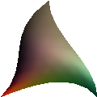</a>
	<a href="files/hw2rectbezglit.txt">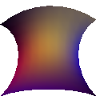</a>
	<a href="files/hw2tribezflit.txt">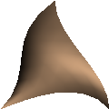</a>
	<a href="files/hw2rectbezflit.txt">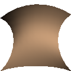</a>
	When lighting a Bezier patch in Gouraud or Phong style, use the normals defined by the interpolated shape.

## Fragment Shaders (0&ndash;120)

Textures (30 points)
:	This is a combination of three commands:
	
	texcoord *s* *t*
	:	adds a texture coordinate to all subsequent vertices (similar to the way `color` does with `trig`).
		If `texcoord` has not occurred prior to an vertex being specified,
		use $(0, 0)$ for that vertex's texture coordinate.
	
	texture *filename.png*
	:	adds a texture image to be used in subsequent drawing commands.
		
		The example images on this page use [splat2.png](files/splat2.png) as the texture image.
		We will test your program with other images and other image sizes too.
		Notably, any of the images created by running your program should work too.
	
	trit $i_1$ $i_2$ $i_3$
	:	<a href="files/hw2texture.txt">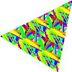</a>
		draw a texture-mapped triangle.
		Interpolate the $(s, t)$ texture coordinates to each fragment;
		the color of each fragment is then the color from the texture
		at the texel closest to $(s w, t h)$ where the texture is $w \times h$ texels in size.
		
		Texture coordinates should wrap; that is, treat -1.3, -0.3, 0.7, 1.7,
		etc, as all mapping to the same texel.
		
		You may assume that `trit` will never be called without `texture` being called earlier in the file.
	
decals (10 points; requires textures and `trig`)
:	<a href="files/hw2decals.txt">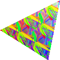</a>
	If the keyword `decals` has appeared in the input file,
	alpha-blend textures on top of the underlying object color
	(interpolated as with `trig`):
	transparent parts of the texture should show the underlying object color.
	
	If `decals` has not appeared in the input file,
	just use textures' RGB values, not the underlying object color, ignoring alpha.

Lighting (25 for sun lights; 30 for point lights; 35 if have both)
:	This is a combination of the `normal` command and at least one lighting command.
	
	normal $x$ $y$ $z$
	:	define a normal, which will be attached to all subsequent vertices and interpolated during scan conversion
	
	sunlight $l_x$ $l_y$ $l_z$
	:	<a href="files/hw2sun1f.txt">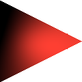</a>
		<a href="files/hw2sun1g.txt">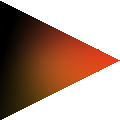</a>
		Add a sun-like light source (infinitely far away) coming from the given direction.
		Store a unit-length version of $l_x$, $l_y$, and $l_z$.
		Use the current color for its light.
	
	bulb $i_1$
	:	<a href="files/hw2bulb1f.txt">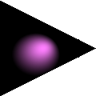</a>
		<a href="files/hw2bulb1g.txt">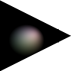</a>
		Add a point light source centered on the vertex given by index $i_1$
		(apply the current model/view matrix but not the current projection).
		Use the current color for its light.
		
		Point lights require you to interpolate the world-coordinate $(x, y, z)$ of each fragment
		as well as its screen coordinate $(x, y, z)$ and its normal;
		the world coordinate is needed to compute the correct direction to the light.
		
		Physically accurate point light intensity would fall with the square of the distance;
		we will not use falloff in this homework.
	
	For each fragment, use Lambert's law to determine the amount of illumination.
	Let $c$ by the cosine of the angle between the surface normal and the light direction,
	$\vec{l}$ be the color of the light, and $\vec{o}$ be the color of the object.
	The color of the fragment is then $c \vec{l} \vec{o}$ where the vectors are multiplied element-wise
	(i.e., red times read, green times green, etc.)

	The dot product can efficiently compute $c$ provided you normalize vectors.
	Do not include lights behind the object (which can be detected by $c < 0$).

Multiple Lights (10 points; requires lighting)
:	<a href="files/hw2suns.txt">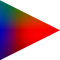</a>
	<a href="files/hw2bulbs.txt">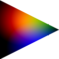</a>
	Allow an arbitrary number of lights, not just one.
	Sum all of their contributions.

Very bright lights and darkness-lights (10 points; requires bulb lighting and multiple lights)
:	<a href="files/hw2darkness.txt">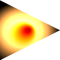</a>
	Allow light colors to exceed $(1, 1, 1)$ to represent very bright lights
	and to be negative to represent (physically impossible) darkness emitters.
	Don't clamp colors until rendering.
	
shininess $\alpha$ (15 points; requires bulb lighting and multiple lights)
:	
	Add a specular component to lighting triangles.
	Use the Blinn-Phong model: the specular intensity is 
	$(\vec{H} \cdot \vec{n})^{\alpha}$
	where $\vec{n}$ is the surface normal
	and $\vec{H}$ is the normalized halfway vector between the direction to the light
	and the direction to the eye.
	Because the Model/View always moves the eye to the origin, the direction to the eye is simply the negative of the location of the point being lit.

	The color added by specularity is the specular intensity times the color of the light.
	The color of the object is not used.

	Only act based on the most recent <code>shininess</code> command.
	If the shininess is &le; 0, do not add specularity.

flatnormals (10 points; requires lighting)
:	<a href="files/hw2flatnormals.txt">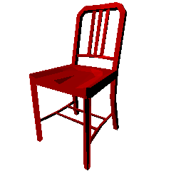</a>
	if the keyword `flatnormals` has appeared in the input file,
	ignore per-vertex `normal`s for `trif` commands
	and instead use the perpendicular vector of the triangle.
	This can be found as $(\vec{p_2}-\vec{p_1})\times(\vec{p_3}-\vec{p_1})$.
