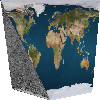
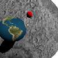
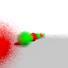

---
title: 'HW3: Raytracer'
new-2021:
	- compute in linear, store in sRGB
    - added exposure functions
notes:
    - consider adding elective HDRI bloom
...

# Overview

This assignment created 3D imagery using ray tracing instead of rasterization.
In most other respects, its logistics are similar to [the previous assignment](hw2.html).

## Ray Emission

Rays will be generated from a point to pass through a grid in the scene.
This corresponds to "flat projection," the same kind that HW2's frustum matrix achieved.
Given an image $w$ pixels wide and $h$ pixels high,
pixel $(x, y)$'s ray will be based the following scalars:

$$s_x = {{2 x - w} \over {\max(w, h)}}$$

$$s_y = {{h - 2 y} \over {\max(w, h)}}$$

$s_x$ and $s_y$ correspond to where on the screen the pixel is:
$s_x$ is negative on the left, positive on the right;
$s_y$ is negative on the bottom, positive on the top.
To turn these into rays we need some additional vectors:

`eye`
:	initially $(0, 0, 0)$. A point, and thus not normalized.

`forward`
:	initially $(0, 0, -1)$. A vector, but not normalized: longer `forward` vectors make for a narrow field of view.

`right`
:	initially $(1, 0, 0)$. A normalized vector.

`up`
:	initially $(0, 1, 0)$. A normalized vector.

The ray for a given $(s_x, s_y)$ has origin `eye`
and direction `forward` + $s_x$ `right` + $s_y$ `up`.

## Ray Collision

Each ray will might collide with many objects.
Each collision can be characterized as $o + t \vec{d}$ for the ray's origin point $o$ and direction vector $\vec{d}$ and a numeric distance $t$. Use the closest collision in front of the eye (that is, the collision with the smallest positive $t$).

## Illumination

Basic illumination uses Lambert's law:
Sum (object color) times (light color) times (normal dot direction to light)
over all lights to find the color of the pixel.

Make all objects two-sided.
That is, if the normal points away from the eye, invert it before doing lighting.

Illumination will be in *linear* space, not sRGB like the previous several assignments.
You'll need to convert RGB (but not alpha) to sRGB yourself prior to saving the image, using the official sRGB gamma function:
$$L_{\text{sRGB}} = \begin{cases}
12.92 L_{\text{linear}} &\text{if }L_{\text{linear}} \le 0.0031308 \\
1.055{L_{\text{linear}}}^{1/2.4}-0.055 &\text{if }L_{\text{linear}} > 0.0031308
\end{cases}$$

# Required Features

The required part is worth 50%

png *width* *height* *filename*
:	same syntax and semantics as previous assignments.

sphere $x$ $y$ $z$ $r$
:	
	Add the sphere with center $(x, y, z)$ and radius $r$ to the list of objects to be rendered.
	The sphere should use the current color as its color (also the current shininess, tecture, etc. if you add those optional parts).
	
	For the required part you only need to be able to draw the outside surface of spheres.

sun $x$ $y$ $z$
:	
	Add a sun light infinitely far away in the $(x, y, z)$ direction.
	That is the "direction to light" vector in the lighting equation
	is $(x, y, z)$ no matter where the object is.
	
	Use the current color as the color of the sunlight.
	
	For the required part you only need to be able to handle one light source.

color $r$ $g$ $b$
:	
	Defines the current color to be $r$ $g$ $b$, specified as floating-point values;
	$(0, 0, 0)$ is black, $(1, 1, 1)$ is white, $(1, 0.5, 0)$ is orange, etc.
	You only need to track one color at a time.
	If no `color` has been seen in the input file, use white.

	You'll probably need to map colors to bytes to set the image.
	All colors &le; 0.0 should map to 0, all colors &ge; 1 should map to 255;
	map other numbers linearly (the exact rounding used is not important).

Overlap
:	
	Your rays should hit the closest object even if there are several overlaping.

sRGB
:	Your computations should be in a linear color space, converted to sRGB before saving the image.
	This is reflected in the colors of every reference image on this page.

Rays, not lines
:	
	Don't find intersections behind the ray origin.

# Optional Features

## Geometry (5–50%)

Handle interiors (requires `bulb`) (10%)
:	
	Correctly render when the camera is inside a sphere

plane $A$ $B$ $C$ $D$ (5%)
:	
	defines the plane that satisfies the equation $Ax + By + Cz + D = 0$

Triangle (requires plane) (15%)
:	
	Add `xyz` and `trif` commands, with the same meaning as in HW2 (except ray-traced, not rasterized).

Interpolate triangles (requires triangle) (5–20%)
:	Triangles can have values interpolated in ray tracing using Barycentric coordinates.
	Examples of values to interpolate:
	
	normal $x$ $y$ $z$ (5%)
	:	
		The same meaning as in HW2

	trit $i_1$ $i_2$ $i_3$ and texcoord $s$ $t$ (15%)
	:	
		The same meaning as in HW2; see also **Textures**
	

## Acceleration (requires multiple suns and shadows) (30%)

Add a spatial bounding hierarchy so that hi-res scenes with thousands of shapes can be rendered in reasonable time.

The basic idea of a bounding hierarchy is simple:
have a few large bounding objects, each with pointers to all of the smaller objects they overlap.
Only if the ray intersects the bounding object do you need to check any of the objects inside it.

For good performance, you'll probably need a hierarchy of objects in a tree-like structure.
In general, a real object might be pointed to from several bounding objects.

Rather than try to inspect your bounding hierarchy code, we'll say you've achieved acceleration if you can render the scene shown here (which contains 1001 spheres, two suns, and shadows) in less than a second.  And yes, this is arbitrary wall-clock time on our test server, and yes this does disadvantage people writing in Python (which is tens to hundreds of times slower than the other languages people are using in this class).

## Lighting (5–50%)

Multiple `sun`s (5%)
:	
	allow an unlimited number of `sun` commands; combine all of their contributions;

bulb $x$ $y$ $z$ (requires multiple suns) (10%)
:	
	Add a point light source centered at $(x, y, z)$.
	Use the current color as the color of the bulb.
	Handle as many `bulb`s and `sun`s as there are in the scene.

	Include fall-off to bulb light:
	the intensity of the light that is $d$ units away from the illuminated point is $1 \over d^2$.

Negative light (requires `bulb`) (5%)
:	
	Allow light colors to be less than zero, emitting "darkness". 

Shadows (10–30%)
:	
	
	
	
	
	No new commands for this one: you get these points if objects always cast shadows, you don't if they don't.
	
	10 points for 1 sun, +5 if planes work, +5 if triangles work, +5 if multiple light sources work, +5 if bulbs work

expose $v$ (10%)
:	
	
	Render the scene with an exposure function, applied prior to gamma correction.
	Use a simple exponential exposure function: $\ell_{\text{exposed}} = 1 - e^{\displaystyle -\ell_{\text{linear}} v}$.
	
	
Fancier exposure functions used in industry graphics,
	such as FiLMiC's popular Log V2,
	are based on large look-up tables instead of simple math but are conceptually similar to this function.

<!--
HDR Bloom (required exposure) (15%)
:	Add an exposure function
	*details an example TBD*
-->

## Materials (5–65%)

shininess $s$ (10%)
:	
	Future objects have a reflectivity of $s$, which will always be a number between 0 and 1.
	
	If you implement transparency and shininess, shininess takes precident; that is, `shininess 0.6` and `transparency 0.2` combine to make an object $0.6$ shiny, $((1-0.6) \times 0.2) = 0.08$ transparent, and $((1-0.6) \times (1-0.2)) = 0.32$ diffuse.
	
	Per page 153 of the [glsl spec](https://www.opengl.org/registry/doc/GLSLangSpec.4.40.pdf),
	the reflected ray's direction is
	
	$$\vec{I} - 2(\vec{N} \cdot \vec{I})\vec{N}$$
	
	… where $\vec{I}$ is the incident vector, $\vec{N}$ the unit-length surface normal.

	Bounce ech ray a maximum of 4 times unless you also implement `bounces`.

shininess $s_r$ $s_g$ $s_b$ (5%)
:	
	Future objects have a different reflectivity for each of the three color channels.
	
transparency $t$ (requires `shininess`) (15%)
:	
	Future objects have a transparency of $t$, which will always be a number between 0 and 1.
	
	Per page 153 of the [glsl spec](https://www.opengl.org/registry/doc/GLSLangSpec.4.40.pdf),
	the refracted ray's direction is
	
	$$k = 1.0 - \eta^2 \big(1.0 - (\vec{N} \cdot \vec{I})^2\big)$$
	$$\eta \vec{I} - \big(\eta (\vec{N} \cdot \vec{I}) + \sqrt{k}\big)\vec{N}$$
	
	… where $\vec{I}$ is the incident vector, $\vec{N}$ the unit-length surface normal, and $\eta$ is the index of refraction.  If $k$ is less than 0 then we have total internal reflection: use the reflection ray described in `shininess` instead.

	Use index of refraction 1.458 unless you also implement `ior`.
	Bounce ech ray a maximum of 4 times unless you also implement `bounces`.

transparency $t_r$ $t_g$ $t_b$ (5%)
:	
	Future objects have a different transparency for each of the three color channels.

ior $r$ (requires `transparency`) (5%)
:	
	Set the index of refraction for future objects.  If `ior` has not been seen (or if you do not implement `ior`), use the index of refraction of pure glass, which is 1.458.

bounces $d$ (requires `shininess`) (5%)
:	
	When bouncing rays off of shiny and through transparent materials, stop generating new rays after the $d$th ray.  If `bounces` has not been seen (or if you do not implement `bounces`), use 4 bounces.

roughness $\sigma$ (requires `shininess`) (10%)
:	
	If an object's roughness is greater than 0, randomly perturbed all three components of the surface normal by a gaussian distribution having standard deviation of $\sigma$ (and then re-normalize) prior to performing illumination, refaction, or reflection.

Textures (10%)
:	This involves at least one command (for spheres) and possibly a second (for triangles, if used)

	texture `filename.png`
	:	
		load a texture map to be used for all future objects.
		If `filename.png` does not exist, instead disable texture mapping for future objects.
		
		Assume the texture is stored in sRGB and convert it to a linear color space prior to using it in rendering.
		
		Example textures include <a href="files/earth.png">earth.png</a> and <a href="files/moon.png">moon.png</a>.
	
	The texture coordinate used for a sphere should use latitude-longitude style coordinates.
	In particular, map the point at 
	
	- the maximal $y$ to the top row of the texture image, 
	- the minimal $y$ to the bottom row, 
	- the maximual $x$ to the center of the image, 
	- the minimal $x$ to center of the left and right edges of the image (which wraps in x),
	- the maximal $z$ to the point centered top-to-bottom and 75% to the right, and
	- the minimal $z$ to the point centered top-to-bottom and 25% to the right.
	
	The standard math library routine `atan2` is likely to help in computing these coordinates.
	
	See also **Interpolate triangles** for the `texcoord` and `trit` commands.

## Sampling (5–65%)

eye $e_x$ $e_y$ $e_z$ (5%)
:	
	change the `eye` location used in generating rays

forward $f_x$ $f_y$ $f_z$ (10%)
:	
	change the `forward` direction used in generating rays.
	Then change the `up` and `right` vectors to be perpendicular to the new `forward`.  Keep `up` as close to the original `up` as possible.
	
	The usual way to make a movable vector $\vec{m}$ perpendicular to a fixed vector $\vec{f}$ is to find a vector perpendicualr to both ($\vec{p} = \vec{f} \times \vec{m}$) and then change the movable vector to be perpendicular to the fixed vector and this new vector ($\vec{m}\prime = \vec{p} \times \vec{f}$).

up $u_x$ $u_y$ $u_z$ (requires forward) (5%)
:	
	change the `up` direction used in generating rays.
	Don't use the provided `up` directly; instead use the closest possible `up` that is perpendicular to the existing `forward`.  Then change the `right` vector to be perpendicular to `forward` and `up`.

aa $n$ (15%)
:	
	shoot $n$ rays per pixel and average them to create the pixel color

fisheye (10%)
:	
	find the ray of each pixel differently; in particular,
	
	- divide $s_x$ and $s_y$ by the length of `forward`, and thereafter use a normalized `forward` vector for this computation.
	- let $r^2 = {s_x}^2 + {s_y}^2$ 
	- if $r > 1$ then don't shoot any rays
	- otherwise, use $s_x$ `right`, $s_y$ `up`, and $\sqrt{1-r^2}$ `forward`.
	
panorama (10%)
:	
	find the ray of each pixel differently; in particular, treat the x and y coordinates as latitude and longitude, scaled so all latitudes and longitudes are represented.  Keep `forward` in the center of the screen.

dof $focus$ $lens$ (requires aa) (10%)
:	
	simulate depth-of-field with the given focal depth and lens size.
	Instead of the ray you would normally shoot from a given pixel, shoot a different ray
	that intersects with the standard ray at distance $focus$ but has its origin moved randomly to a different location within $lens \over 2$ of the standard ray origin. Keep the ray origin within the camera plane (that is, add multiples of the `right` and `up` vectors but not `forward`.
	
	If you do `dof` and `fisheye` or `panorama`, you do not need to (but may) implement `dof` for those alternative projections.

## Speed

For real raytracers, speed is all-important:
the amount of fancy things an artist can afford to do is based on how quickly the basics can be handled.
These scenes are not for credit, but will give you some examples to play with if you want to try to get your code fast.

My reference implementation can render this image in just under 1 minute on my desktop computer
or just under 4 minutes on my laptop.
It makes use of multiple suns, shadows, `aa`, `dof`, `shininess`, `roughness`, and `plane`.
If I disable all of those, it runs in 0.2 seconds (desktop) or 0.8 seconds (laptop).
This scene also is suitable for an even faster implementation (maybe a 10× speedup) because its objects are all about the same size, have little overlap, and are roughly evenly distributed across the scene.

This image has half as many spheres and half the anti-aliasing of the previous image, but takes almost as long (50 seconds on my desktop) because the spheres vary a lot in size and overlap a lot, which makes acceleration more difficult.
