---
title: 'HW5: Simulation'
notes:
    - bones
        - track to
            - principle axis via cross product
        - track point to
            - (track pt) (track goal) (track pt)^-1
        - track and scale to
        - track and stretch to
        - FABRIK
        - FABRIK with starter pose
    - fireworks
        - bounce walls
        - reburst
        - time-lapse dynamics
        - keyframe
    - boids
    - landscape
        - square-square
        - diamond-square
        - erosion
        - keyframe
    - tree
        - L-system
        - stochastic
        - pruned
        - light and gravity
    - rope
        - mass-spring
        - tri-diagonal
    - fluid
        - shallow water
        - stam
...

<blockquote style="background-color:#fbb; font-size:150%">This page is a work-in-progress and may change at any time without notice.</blockquote>

# Overview

This assignment may result in several different programs.
Instead of `make run` we will use several different make targets, one for each broad simulation type.

The required part of this assignment is "earn 50 points on this assignment".
The optional part is any points in excess of 50 that you earn.

## `make bones` *filename* (15–100 points)

This is an extension of HW4: everything that was required in HW4 is required in this program too.

You may find our [bones writeup](bones.html) to be helpful.

bone $d$
:   This may appear at most once in any `object`.
    If present, it means that this object is considered to be a bone,
    with object-space origin $(0,0,0)$ and object-space tip $(0,0,d)$.
    
    A bone may have geometry, but doesn't need to.
    A bone may have the `world`, another bone, or a non-bone as its parent.
    
    The remaining keywords in this section apply only to bones and will follow the `bone` command in the input.

track *object* (requires `bone`; 15–30 points)
:   After applying other transformations (including positioning and rotation),
    rotate the object to the bone's tip points toward the named *object*.
    This should be a minimal rotation to achieve that goal, staying as close to the previous orientation as possible.

    Basic (15 points)
    :   

    Rotation and negative length (5 points)
    :   

    Tracking parent and target (10 points)
    :   

trackroll *primary* *axis* *secondary* (requires `track`; 10–20 points)
:   After applying other transformations (including positioning and rotation),
    rotate the object to the bone's tip points toward the named *primary* object.
    There are many such rotations; pick the one that points the bone's *axis* points toward the named *secondary* object as much as possible.
    *Axis* will always be one of `+x`, `-x`, `+y`, or `-y`.
    
    Basic (10 points)
    :   <a href="files/hw5bones-trackroll.txt">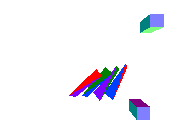</a>
    
    Tracking parent and target (10 points)
    :   <a href="files/hw5bones-trackroll2.txt">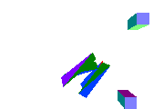</a>

trackscale *object* (requires `track`; 10 points)
:   <a href="files/hw5bones-trackscale.txt">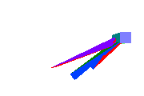</a>
    Like `track`, but also scale along the object's $z$ axis to that the tip of the bone exactly reaches the given object. Do not scale along the object's other two axes.

trackstretch $x$ $y$ $z$  (requires `trackscale`; 5 points)
:   <a href="files/hw5bones-trackstretch.txt">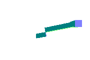</a>
    Like `trackscale`, but also scale uniformly along the object's $x$ and $y$ axes such that the volume of the bone is conserved.

fabrik *object* *iterations* (20–35 points)
:   Use FABRIK to perform inverse kinematics,
    where the IK chain consists of this bone and all its bone parents.

    Recall that one iteration of FABRIK moves the bone tip to *object*,
    then moves the chain root back to its starting location.
    Compute *iterations* iterations in total.
    
    Each frame should begin the iteration from the positions provided by any `position` and `quaternion` commands.
    None of the bones in an IK chain will have a track or related command.
        
    FABRIK produces the origins and tips of a chain of bones.
    Use the same math as `position` and `track` to align the bones with these points.

    Basic (20 points)
    :   <a href="files/hw5bones-fabrik.txt">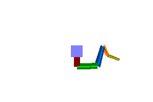</a>
        
    With moving root (15 points)
    :   

## `simulation fluid` (70–100 points)

This is not an extension of any other assignment.
You'll output 2D fluids directly to the pixels of an image file (I guess we could say it's an extension of HW0?).

Use back-advection to provide unconditionally stable simulations.
When back-advecting off the grid, assume velocity is 0 and temperature is equal to the nearest on-grid temperature.

pngs *width* *height* *filename* *frames*
:   same syntax and semantics as HW0.
    
    Each pixel in the image will represent a cell in a Eulerian fluid grid.
    Bigger images = higher-resolution fluids.
    Every cell will be full of fluid.

heat *h* *bouyancy* *mag* (70 points)
:   <a href="files/hw5fluid-basic.txt">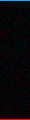</a>
    <a href="files/hw5fluid-basic2.txt">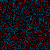</a>
    To create motion in the fluid, track something we'll call the "temperature" of each pixel.
    We won't simulate temperature-based expansion, but will approximate temperature-based buoyancy.
    
    We'll let temperature range from $-1$ to $1$.
    Each pixel experiences an upward force with strength *temperature* × *bouyancy* pixels / *frame*2.
    
    The input *h* represents a rate of heat transfer into the fluid.
    The bottom row of pixels is heated, so $t' = h + (1-h)t$ each frame;
    the top row is cooled, so $t' = -h + (1-h)t$ each frame.
        
    Use heat as the color of each pixel.
    Linearly interpolate between the following colors:
    
    | Temperature |  Color  |
    |:-----------:|:-------:|
    | $1$         |`#ff0000`|
    | $0$         |`#000000`|
    | $-1$        |`#00B2FF`|
    
    If temperatures are outside this range, you may color them in an implementation-defined manner.
    
    For the first frame, set each cell to have a random temperature between −*mag* and +*mag*. This randomization breaks symmetry and gets the simulation started.
    Because of randomization, each run of a given file will produce a different result (but with the same overall dynamics).

diffuse *rate* (10 points)
:   
    Diffuse heat at the given *rate* each frame using a [discrete Gaussian filter](diffusion.html) with *rate* as $t$.

viscosity *rate* (10 points)
:   <a href="files/hw5fluid-viscosity.txt">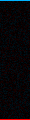</a>
    Diffuse velocity at the given *rate* each frame using a [discrete Gaussian filter](diffusion.html) with *rate* as $t$.

subsample *n* (10 points)
:   
    Render one image every *n* frames, where *n* is a positive integer.

    for example, if the *frames* in the `pngs` is 100 and the *n* in `subsample` is 4
    then you'll simulate 400 frames but render only 100 images.

Other examples
:   <a href="files/hw5fluid-diffvisc.txt">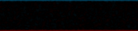</a>

## `simulation fireworks`

burst *type* $n$ $x$ $y$ $z$ $t$ $v$
:   At frame $t$, create a burst of $n$ moving particles of the given *type* centered at $(x,y,z)$ with burst velocity $v$.
    The types are:
    
    `normal`
    :   Select velocities from a 3D normal distribution with standard deviation $v$
    
    `sphere`
    :   Select velocities uniformly from a radius-$v$ sphere

    `shell`
    :   Select velocities uniformly from the surface of a radius-$v$ sphere

    Every `burst` command will be followed by a shape command
    
billboard $w$
:   A shape command: draw each particle from the preceding `burst` as a $w$-by-$w$ square
    that is aligned to point to the camera.
    And orientation other than that (side up, point up, etc) is up to you.

dart $w$
:   A shape command: draw each particle from the preceding `burst` as an equilateral triangle with edge length $w$
    aligned with a face toward the camera
    and a point in the direction of its motion.

box $w$
:   A shape command: draw each particle from the preceding `burst` as a global axis-aligned cube with $w$-length edges.

gravity $x$ $y$ $z$
:   Accelerate moving particles by $x$ units-per-frame in the x axis, $y$ units-per-frame in the y axis, and $z$ units-per-frame in the $z$ axis

drag $d$
:   Decelerate moving particles by $dv$ where $v$ is the participles current units-per-frame velocity.
    You may assume $0 \le d \le 1$;
    if $d = 1$ then particles will instantly stop; if $d = 0$ then there is no drag.

wall *bounciness* $A$ $B$ $C$ $D$
:   An infinite plane that particles cannot penetrate;
    enforce that $Ax + By + Cz + D \ge 0$ for all particles.
    If *bounciness* is 0, remove all velocity into the plane.
    If *bounciness* is 1, reverse any velocity into the plane.
    For intermediate *bounciness*, reverse velocity into the plane and reduce its magnitude.

reburst *type* *chance* $n$ $t$ $v$
:   $t$ frames after the start of the preceding `burst`,
    each particle created by that `burst` is destroyed.
    For each such particle, there is a *chance* percent chance that it becomes the center of a new `burst` of the given *type*, $n$, and $v$
    and a (100 − *chance*) percent chance that it instead simply vanishes.

selfcollide *elasticity* $r$
:   Treat each particle as a sphere with radius $r$
    and resolve particle-particle collisions so that no to particles ever overlap.
    When a collision occurs, use the given *elasticity* to resolve it:
    *elasticity* 0 causes the two to stick together, *elasticity* 1 causes them to bounce off with full energy.
    
    Assume all particles have the same mass. All particle-particle collisions should preserve momentum.
    
    
## `simulation boids`

Implement [Craig Reynold's Boids algorithm](https://www.red3d.com/cwr/boids/)

distance $d$
:   The sensing distance, as defined in the Boids algorithm page linked above.

angle *degrees*
:   The sensing angle, as defined in the Boids algorithm page linked above.

maxturn *degrees*
:   Limit each boid to turning at most the given number of degrees each frame

speed *min* *max*
:   Keep each boid moving between these two units-per-frame speed bounds

steering $s$ $a$ $c$
:   Defines the balance between the three steering behaviors.

    Separation $s$ turns away from neighbors, with weight proportional to inverse squared distance.
    
    Alignment $a$ turns the boid to face in the average direction of all other boids at speed ½(*min* + *max*)
    
    Cohesion $c$ turns toward the mean position of neighbors.
    
    Compute the desired turn and speed for each of these three forces independently,
    then average them using the weights given.
    We will only provide $s+a+c = 1$.
    
    

## `simulation landscape`

## `simulation trees`

## `simulation springs`

<!--

# Required Features

The required part is worth 50%

input *filename*
:   load the given RGBA png file as the current image.

output *filename*
:   save the current image as the given RGBA png file.

monochrome *channel*
:   <a href="files/hw5monochromeL.png">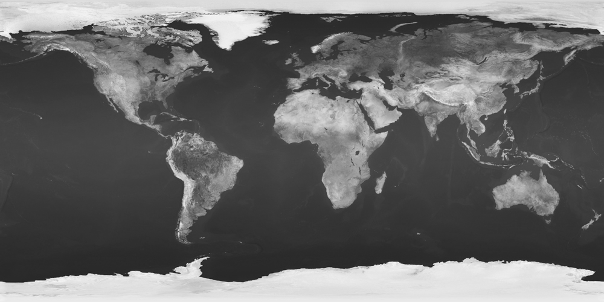</a> <a href="files/hw5monochromeL.txt">hw5monochromeL.txt</a>
    <a href="files/hw5monochromeS.png">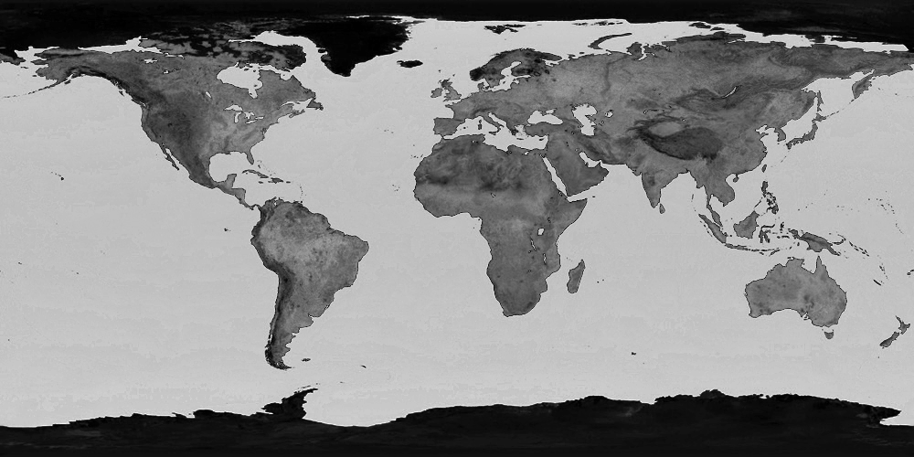</a> <a href="files/hw5monochromeS.txt">hw5monochromeS.txt</a>
    <a href="files/hw5monochromeH.png">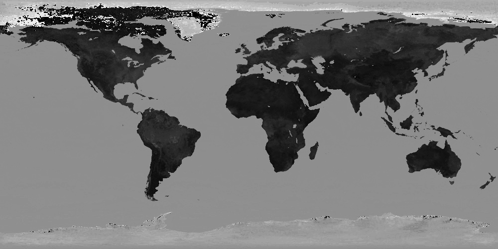</a> <a href="files/hw5monochromeH.txt">hw5monochromeH.txt</a>
    Replace the red, green, and blue channels of the current image with a copy of the given channel.
    Set every alpha value to 1.
    
    You may assume that *channel* is one of the following eight strings: `red`, `green`, `blue`, `alpha`, `hue`, `saturation`, `value`, `lightness`.
    
    This operator can typically be done in-place, though it also works if you copy the image.

equalize *channel*
:   <a href="files/hw5equalize.png">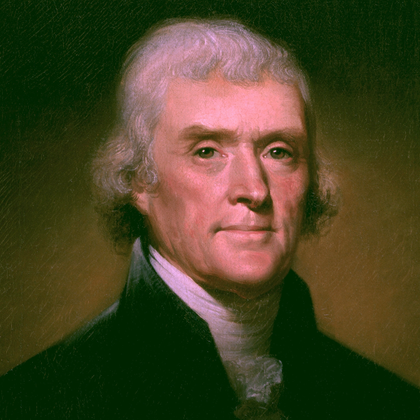</a> <a href="files/hw5equalize.txt">hw5equalize.txt</a>
    Find the minimum and maximum value of the specified channel in the image.
    Then replace every pixels' entry in that channel with $channel\_value - minumum \over maximum - minimum$.

    You may assume that *channel* is one of the following three strings: `red`, `green`, `blue`.
    
    This operator can typically be done in-place, though it also works if you copy the image.

gradient
:   <a href="files/hw5gradient.png">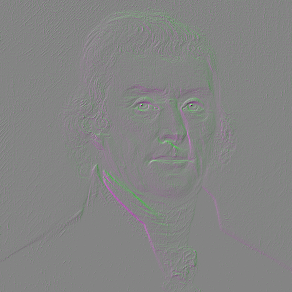</a> <a href="files/hw5gradient.txt">hw5gradient.txt</a>
    The Scharr 3-by-3 convolution filter
    $\displaystyle \frac{1}{16}\begin{bmatrix}+3&+10&+3\\0&0&0\\-3&-10&-3\end{bmatrix}$
    will find the $y$-gradient of the image; its rotated version
    $\displaystyle \frac{1}{16}\begin{bmatrix}-3&0&+3\\-10&0&+10\\-3&0&+3\end{bmatrix}$
    will find the $x$-gradient.
    You'll need those gradients for many of the optional parts.
    
    For the required part, 
    set the green channel of the image to the $y$-gradient of the lightness channel
    and both the blue and red channels to the $x$-gradient of the lightness channel.
    
    This operator can typically cannot be done in-place; you'll need to make a copy of the image first.

# Optional Features

## Pixel-based

All Channels (20%)
:    <a href="files/hw5equalizeL.txt">hw5equalizeL.txt</a>
     <a href="files/hw5equalizeH.txt">hw5equalizeH.txt</a>
    Extend all operations to work on any of the eight channels.
    
    When setting Hue, Saturation, or Value, assume that the other two of those are held constant.
    When setting Lightness, scale R, G, and B by new lightness &div; old lightness.
    
    Black is a special case for almost all of these; you are welcome to handle initially-black pixels however you wish.

posterize *channel* $n$ (10%)
:   <a href="files/hw5posterize.png">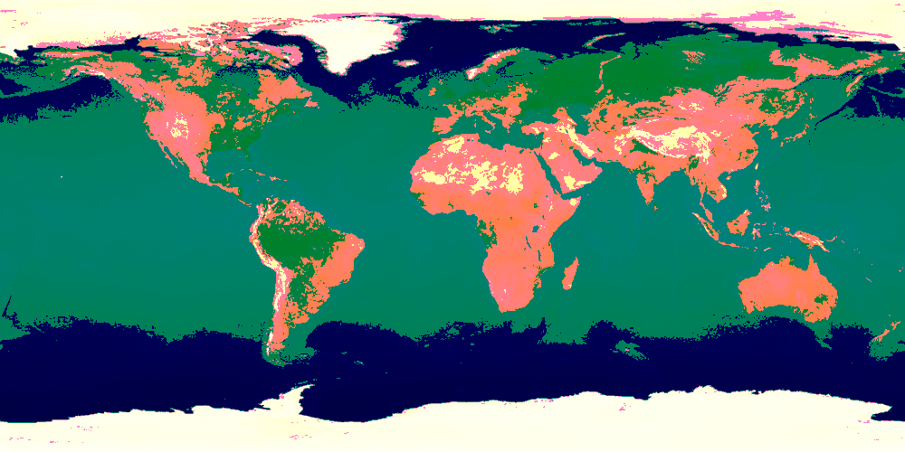</a> <a href="files/hw5posterize.txt">hw5posterize.txt</a>
    Clamp the given channel to just $n$ distinct values, $i \over n - 1$ for $i \in \{0, 1, 2, \dots, n-1\}$.
    Move every pixel's value in the given channel to the nearest of those values.
    
    You may assume that $n \ge 2$ and that *channel* is one of the following four strings: `red`, `green`, `blue`, `alpha`.

dither *channel* $n$ (10%; requires `posterize`)
:   <a href="files/hw5dither.png">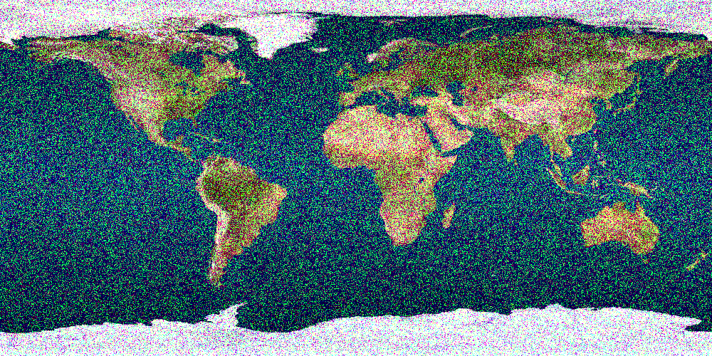</a> <a href="files/hw5dither.txt">hw5dither.txt</a>
    Clamp the given channel to just $n$ distinct values, $i \over n - 1$ for $i \in \{0, 1, 2, \dots, n-1\}$.
    For any pixel whose value is between two of the output values, pick one of the two nearest values randomly
    with probability proportional to the nearness to each.
    
    You may make the same assumptions about $N$ and *channel* as you did for `posterize`.

rehue $d_H$ (15%)
:   <a href="files/hw5rehue.png">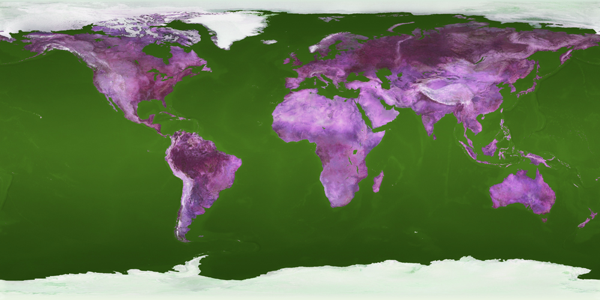</a> <a href="files/hw5rehue.txt">hw5rehue.txt</a>
    Replace every color's old hue $H$ with $H+d_H$, wrapping back into the 0--1 range after the addition.

## Convolution-based

convolve *channel* $w$ $h$ $n_1$ $n_2$ ... $n_{wh}$ (20%)
:   <a href="files/hw5convolve.png">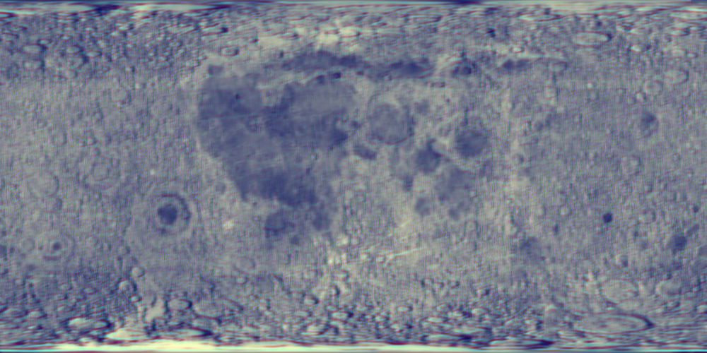</a> <a href="files/hw5convolve.txt">hw5convolve.txt</a>
    Apply the specified convolution filter to the given channel of the current image.
    You may assume that $w$ and $h$ are both odd numbers
    and that the *channel* is one of `red`, `green`, `blue`, or `alpha`.
    The result of the convolution should become the new current image.

blur *channel* $n$ (10%)
:   <a href="files/hw5blur.png">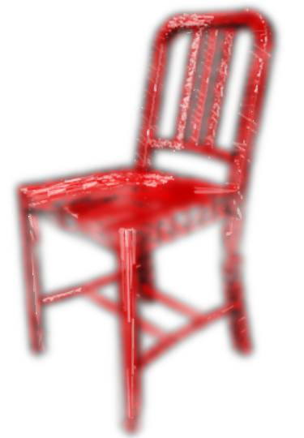</a> <a href="files/hw5blur.txt">hw5blur.txt</a>
    Convolve the given *channel* in x and in y by a discrete approximation of a Guassian filter with $n$ entries.
    The entries should be normalized binomial coefficients (i.e., the $n$^th^ row of [Pascal's triangle](https://en.wikipedia.org/wiki/Pascal%27s_triangle)
    divided by $2^{n-1}$);
    for example, $n=7$ will give the filter $\frac{1}{64}\begin{bmatrix}1&6&15&20&15&6&1\end{bmatrix}$.
    
    You may assume that $n$ is a positive odd integer and that *channel* is one of the following four strings: `red`, `green`, `blue`, `alpha`.

sharpen *channel* $a$ (10%)
:   <a href="files/hw5sharpen.png">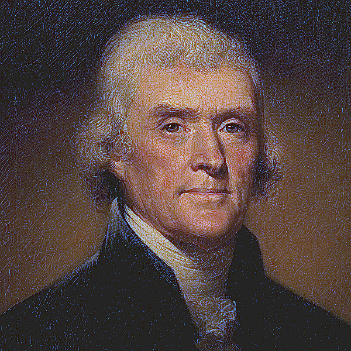</a> <a href="files/hw5sharpen.txt">hw5sharpen.txt</a>
    Sharpen the given *channel* of the image by convolving it with the matrix
    $$\begin{bmatrix}-0.1a&-0.15a&-0.1a\\-0.15a&1+a&-0.15a\\-0.1a&-0.15a&-0.1a\end{bmatrix}$$

    You may assume that *channel* is one of the following three strings: `red`, `green`, `blue`.

edges $min$ $max$ (15%)
:   <a href="files/hw5edges.png">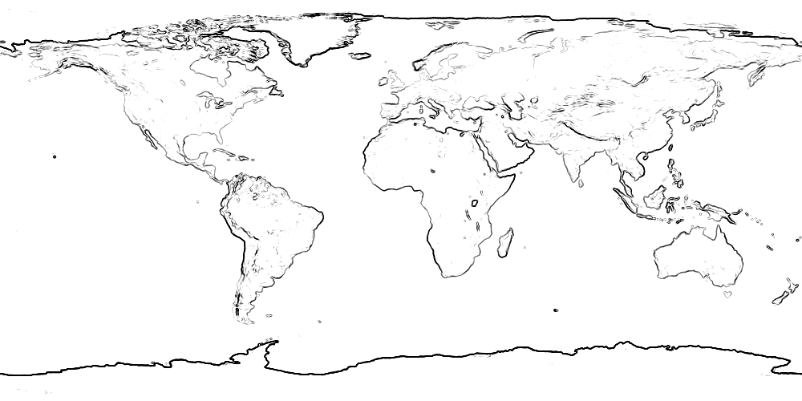</a> <a href="files/hw5edges.txt">hw5edges.txt</a>
    Compute the $x$ and $y$ gradients of the image in all R, G, and B
    and combine those six values using Euclidean distance (i.e., $\sqrt{G_{r,x}^2 + G_{r,y}^2 + G_{g,x}^2+\dots}$).
    Scale the resulting value so that $min$ becomes 0 and $max$ becomes 1.
    Use $1 -$ that result to set the R, G, and B values of the current image; set A to 1.

## Non-local

flood $x$ $y$ $\Delta$ $r$ $g$ $b$ $a$ (10%)
:   <a href="files/hw5flood.png">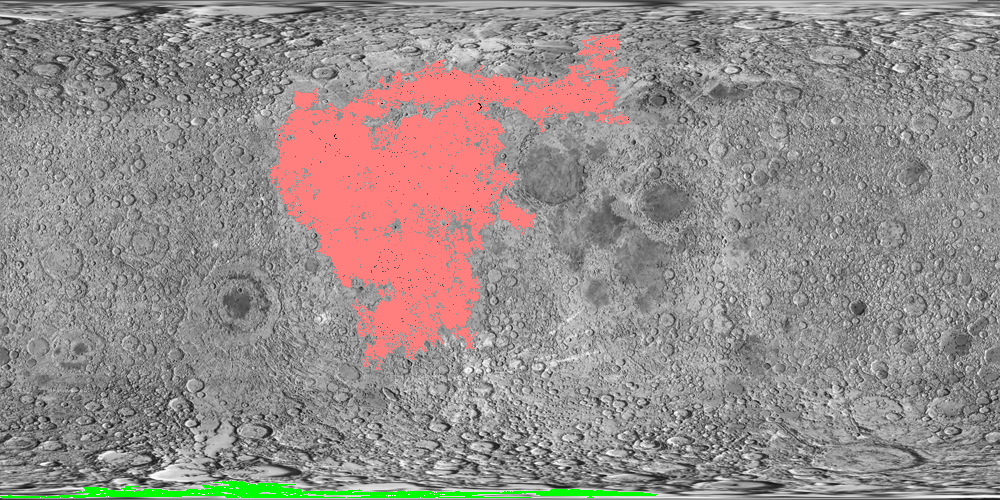</a> <a href="files/hw5flood.txt">hw5flood.txt</a>
    Flood fill the image, starting with the pixel at coordinate $x$, $y$,
    with the color $(r, g, b, a)$.
    Fill any pixel that is four-connected to another filled pixel and is within $\Delta$ (which will be between 0 and 1) of the original pixel at coordinate $x$, $y$ in all four of the RGBA channels.
    
    You may assume the initial color at $(x,y) \ne (r,g,b,a)$ 

carve narrow *and* carve short (30%)
:   <a href="files/hw5carve.png">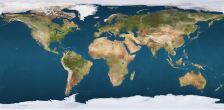</a> <a href="files/hw5carve.txt">hw5carve.txt</a>
    Use [seam carving](https://www.cs.virginia.edu/tychonievich/4810/F2016/notes.php?date=20161103) to make the image one pixel `narrow`er in width or `short`er in height.
    Use gradient magnitude as a proxy for visual interest.
    In case of a tie (two or more seams of equally low total interest), pick one arbitrarily.
    
    To find the gradient magnitude,
    compute the $x$ and $y$ gradients of the image in all R, G, and B
    and combine those six values using Euclidean distance (i.e., $\sqrt{G_{r,x}^2 + G_{r,y}^2 + G_{g,x}^2+\dots}$).
    
path $x_1$ $y_1$ $x_2$ $y_2$ $r$ $g$ $b$ (30%)
:   <a href="files/hw5path.png">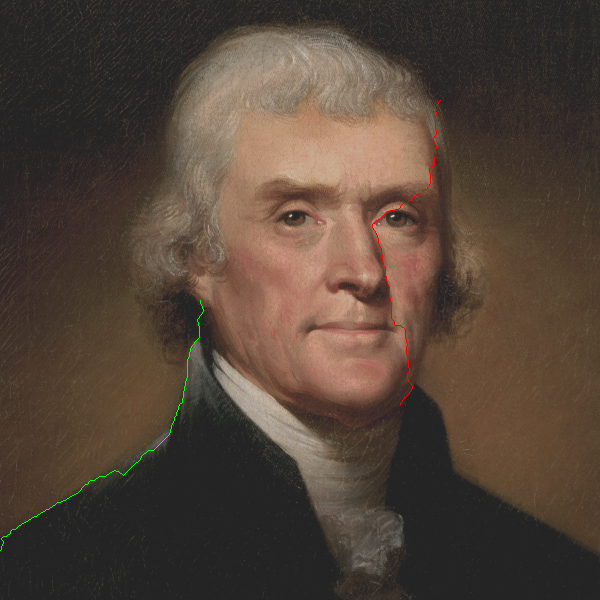</a> <a href="files/hw5path.txt">hw5path.txt</a>
    Use a shortest-path algorithm to connect the two input pixels $(x_1, y_1)$ and $(x_2, y_2)$.
    Fill the input pixels, and all pixels on the path between them, with the color $(r, g, b, 1)$.
    
    Each pixel has eight neighbors.
    The "distance" to a neighbor is Euclidean distance (1 for 4-connect neighbors, $\sqrt{2}$ for diagonal neighbors)
    times the "flatness" of the neighbor being entered (there are various ways to compute that; we'll use $1 \over \mathrm{gradient\;magnitude} + 0.1$).

    To find the gradient magnitude,
    compute the $x$ and $y$ gradients of the image in all R, G, and B
    and combine those six values using Euclidean distance (i.e., $\sqrt{G_{r,x}^2 + G_{r,y}^2 + G_{g,x}^2 + \dots}$).

advect *chan* $d$ (20%)
:    <a href="files/hw5advect.txt">hw5advect.txt</a>
    Use back-advection to move colors around the image.
    The new color of pixel $(x, y)$ should be computed 
    as the color of the image at $(x + g_x d, y + g_y d)$
    where $(g_x, g_y)$ is the gradient of the *chan* channel of the image at $(x, y)$.
    
    When sampling a pixel at location $(x,y)$ with non-integer coordinates, 
    use a weighted average of the pixels at 
    $(\lfloor x\rfloor, \lfloor y\rfloor)$,
    $(\lceil x\rceil, \lfloor y\rfloor)$,
    $(\lfloor x\rfloor, \lceil y\rceil)$, and
    $(\lceil x\rceil, \lceil y\rceil)$.
    

-->
