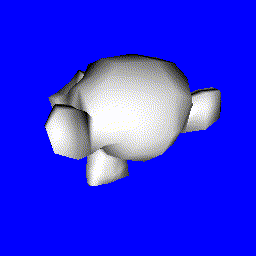
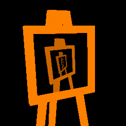
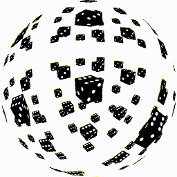
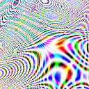

---
title: 'HW4: WebGL'
...

# Overview

This assignment is unlike the ones before;
in it you should create one or more HTML files that utilize WebGL and the TWGL library.

When you submit, us the "other" language option.

You may look for example code online; if you use any source other than [twgljs.org](http://twgljs.org), document those sources in `<!-- HTML comments -->` in your submitted files

# Resources

To assist you in your project, we provide the following code snippets that you are welcome to use:

- A set of arrays representing the Blender [monkey model](files/suzanne.txt) with smooth-shading surface normals.
- Two sets of arrays representing a simple [easel and canvas](files/easel.txt) with texture coordinates for the canvas
- A set of arrays representing [the red chair](files/redchair.txt) with flat-shading surface normals
- A set of arrays representing [an icosahedron](files/icosa.txt) with normals and texture coordinates (see [d20.png](files/d20.png) and [ico.png](files/ico.png) for example texture maps)
- A set of arrays representing [an cube](files/box.txt) with normals and texture coordinates (see [dice.png](files/dice.png) for example texture maps)

To use these arrays, copy-and-paste their contents into your javascript and then use them with `twgl.createBufferInfoFromArrays(gl, the_array_you_choose)`.

# Required

overview.html
:   
    Create a file that has either the red chair or the monkey with a perspective camera that moves around to view it from different angles.
    Have something that looks like lighting for the model.
    
    The easiest way to do this is to create two `uniform mat4` in your vertex program, 
    one modelview and one projection, 
    and use `twlg.m4.lookat` and `twgl.m4.perspective` to initialize them in your javascript,
    changing the parameters to `lookat` based on the current time.
    
    Lighting is as easy as multiplying color by the dot product of the normal (which you'll need to make an `attribute` in the vertex program and a `varying` in both the vertex and fragment programs)
    with some arbitrary fixed vector.

# Optional

Implement at least one of the following.

recursion.html
:   
    Create a file that uses the HTML `canvas` in which the webgl is being rendered as the source of a texture.
    You'll need to also have some objects that don't use that texture or you won't see anything.
    Have your `render` function re-set the texture periodically.
    
    Note, if you re-set the texture every single frame then you have a reasonable chance of freezing your computer due to too much CPU/GPU bandwidth, but doing that for a second or two at the beginning of the animation might work well.
    

fisheye.html
:   
    Create a file with a vertex shader that implements a fisheye projection.
    You'll need to have several copies of an object in the scene to demonstrate that it is working.
    
    Fisheye is easy to compute: instead of using a projection matrix, divide $x$ and $y$ with the length of the $(x, y, z)$ point.
    For most modelview matrices you'll also need to adjust $z$ so that you only see one half of the scene (`z -= 1.0` might suffice).

psychedelic.html
:   
    Fill the entire canvas with a rendered object.
    Have the fragment shader color each pixel based on some function of the fragment coordinate and the current time to get some kind of psychedelic color pulse.
    
    TWGL has [an example](http://twgljs.org/examples/tiny.html) you can work from, though you should write your own fragment shader.
    Using sines and cosines of polynomial functions of time, x, and y to determine colors is a good way to start.

bouncebox.html
:   <video class="demo floater zoom" controls autoplay loop><source src="files/bounce.webm"/></video>
    Have some object bounce around inside a box.  No need to draw the box.

other.html
:   Do something else cool.  Coolness and novelty to be determined at instructor discretion.
